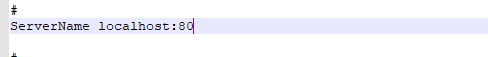
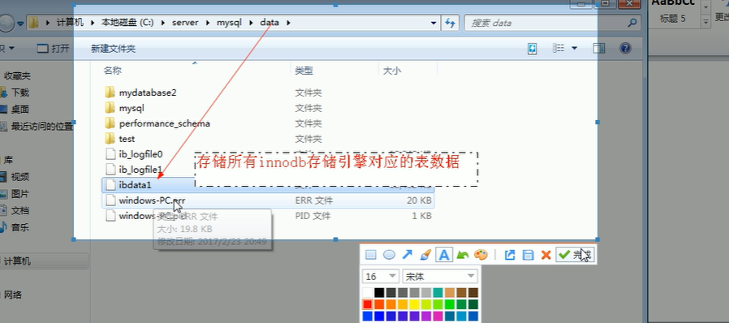
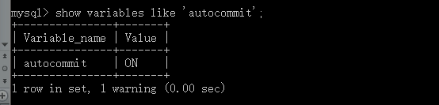
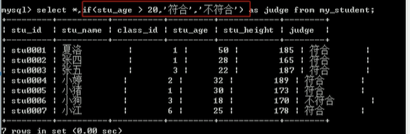
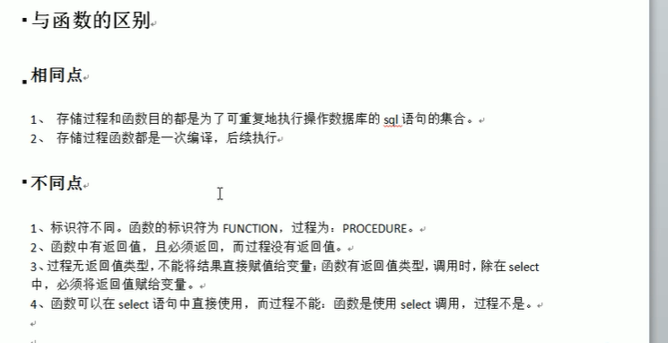
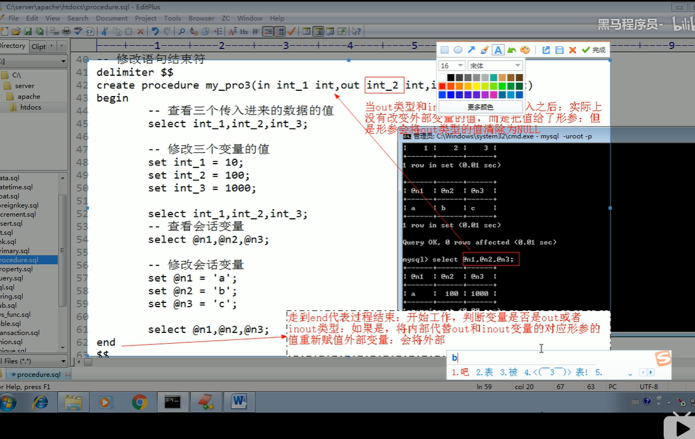
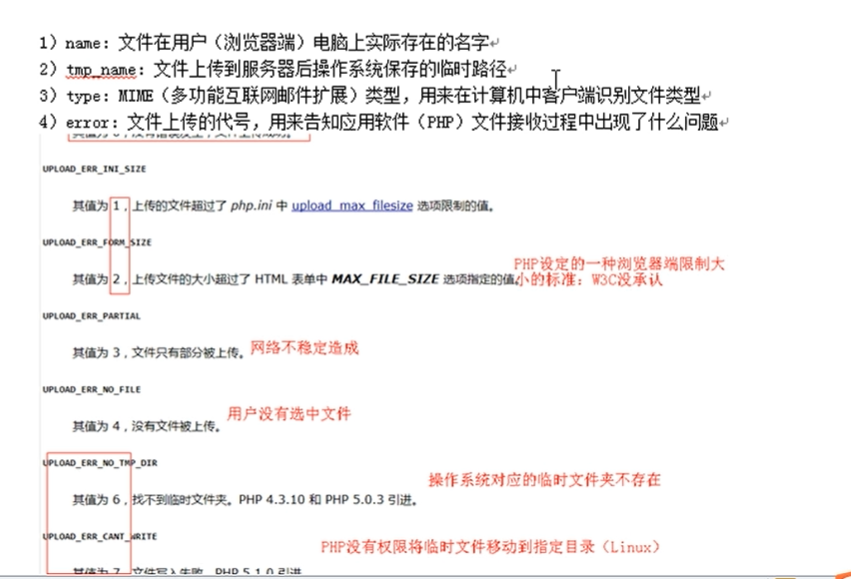
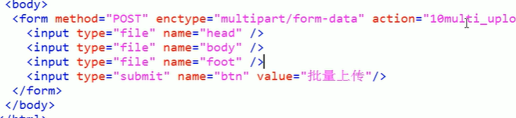
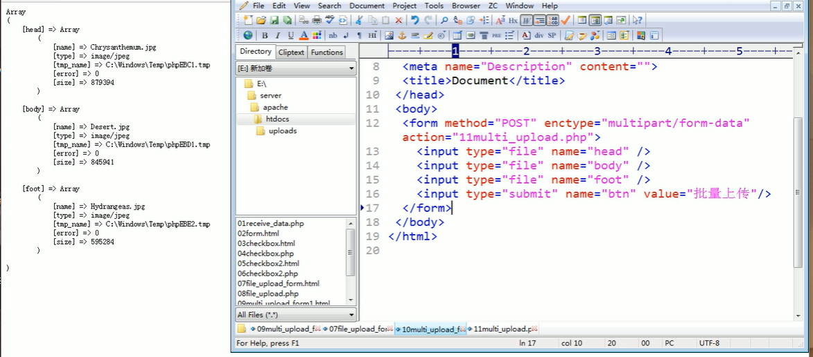
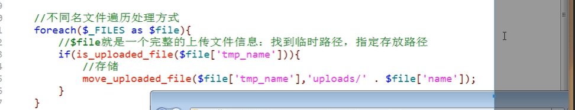

[toc]

### apache目录结构：


* conf：配置文件目录
* htdocs：apache默认的主机地址：网站的根目录
* modules：所有的功能都是模块化的
* 

httpd.exe:查看功能和配置文件是否有错

httpd -M :显示模块：静态和shared

httpd  -t:查看配置是否正确


### 配置默认的站点：

1. 让Apache确定服务器的访问的位置：网站文件夹所在的位置

   1. heepd.cof:DocumentRoot

2. 方便用户使用名字访问对应的网站：给文件夹取别名 

   ​	

   

3. 实现DNS域名解析：通常默认的站点都是本地的DNS：hosts文件

4. 配置后要重启生效

   

### php目录结构：

* ext：扩展包
* php.exe:php解释器
* 配置文件：php.ini

### apache 加载php模块

1. Apache加载PHP模块：在Apache的主配置文件中加载对应的PHP提供的模块
   1. loadModule php5_module  php所提供的模块链接路径
2. Apache分配工作给PHP模块：文件后缀判断
   1. AddType application/x-httpd-php  .php
3. 将PHP配置文件加载到Apache配置文件中：共同生效
   1. 在Apache中指定PHP配置文件所在路径 PHPIniphp.ini 所在路径
   2. PHP.ini 默认是以development存在的 改为.ini

### mysql

目录结构：

data:数据存储文件夹

lib：核心文件夹

bin常用命令：

mysql是c/s架构的软件：通过客户端来访问 通过插件访问


命令：mysql.exe -hlocalhost -p3306 -uroot -p011999

mysql.exe uroot -p011999

退出：\q

***php操作MySQL***

1. PHP加载mysql扩展：php.ini

## php基本语法、

标准标记：<？php  code ?>

` 

```php
 <?php
                echo 'helloword';
  ?>
```

* 注释

1. 行注释：//or #
2. 块注释：/* */

* 语句分割

  * ***最后一行自带结束 ***

* 变量

  ```php
  <?php
  $x=1;
  echo '<hr/>',$x;
  ?>
  ```

  * 预定义变量：

    ```php
    $_GET:get提交的数据
    $_POST：post提交的数据
    $_REQUSET:get和post提交的都保存
    $GLOBALS:全局变量
    $_SERVER:服务器信息
    $_SESSION:会话信息
    $_COOKIE:
    $_ENV:环境信息
    $_FILES:用户上传的文件信息
    
    ```

  * 可变变量：

    ```php
    $a=b;
    $b=bb;
    echo $$a
        //结果为bb
    ```

    

    * 变量传值：

      1. 值传递

      2. 应用传递：地址传递给另一个变量 指向同一个地址 变量是同一个值

         ```php
         $var=1;
         $b=&$var;
         
         $var=2;
         echo $var,$b;//var=2 b=2
         ```

         

#### 常量

```php
define('常量名'，常量值)；//法一 特殊符号用 可以区分大小写
    //输出特殊符号常量：
    echo constant('常量');
    define('PI',3.14);
const 常量名=值;//法二
	const pi=3.14;

```

***不需要$符号，大写定义必须赋值***

#### 系统常量

```php
//PHP版本号
PHP_VERSION:
//整形大小
PHP_INT_SIZE:
//整数所能表示的最大值
PHP_INT_MAX
    
```

***系统魔术常量***

```php
__DIR__:脚本的绝对路径
__FILE__:同上 加自己名字
__LINE__:所在行
__NAMESPACE__
    
__CLASS___
__METHOD__:所属的方法
    
```


#### 数据类型

变量无类型：指的是所存储的类型

int：4字节

浮点型：8字节

***类型转化***

```php
//自动转化 效率低<?php

$a='111.11adb';
$b='sfsfsf111.11';//字符串开头的转化为0
echo $a+$b;

?>
//判断数据类型
var_dump(is_int(a));
var_dump(is_string(b));
//获取数据类型
echo Gettype(a);
//设定数据类型
//Settype()//直接操作被操作数 改变原始的数据
echo Settype($b,'int');
```

***基本数据类型***

1. **整数**

   


#### 文件包含

```php
//文件包含 嵌套

```


#### 函数

```php
 //function ();执行可以在函数定义之前
//默认值  默认值从右到左
//函数的形参在不同的函数和外部可以相同
//引用传递 只用变量可以传递 变量指向的是地址
function display($a,&$b)
    display($a,$b);


```

#### 变量类型

```php
//全局变量 在函数内部不可以访问
//超全局变量 所有都可以访问
//局部变量访问全局变量
$global='global area';//$GLOBALS['global']='global area'
//global关键字 访问局部和外部 函数内部定义外也有 则指向同一个地址
//外部不存在 则在外部定义同名的全局变量 本质都是在函数内部和外部的同名变量指向同一地址


//静态变量 使用static 跨函数共享的数据变量 同一个函数被多次调用 函数多次调用的时候会跳过static关键字

function display(){
static $s=1;
$local='loacl';
echo $s++;
}

display();
display();
display();
echo '<hr/>';
```

#### 可变函数

```php
//可变函数 变量所保存的值是函数名字 回调函数 传入函数到函数内部

$fun='display';
$fun();
echo '<hr/>';
//匿名函数
/*
变量名 =function(){

};
*/
$fun=function(){
    echo 'hello world';
};
$fun();
echo '<hr/>';
```

#### 系统常用函数

```php
//print_r:输出数值 不输出类型
print_r($fun);
print '<br/>';
echo time();
//数学相关的函数
//rand()//指定区间的随机数 
//mt_rand()//效率高的随机数
//ceil()//向上取整、
//floor()//向下取整
//pow(2,8)//2^8
echo '<hr/>';
//函数相关的函数
function test($a,$b){
    var_dump(func_get_arg(1));//获取第一个参数数值
    //获取所有的参数
    var_dump(func_get_args());
    var_dump(func_num_args());//获取参数个数
    
}
function_exists('test')&&test(1,'244',3,4);//函数存在则执行


```

#### 错误类型和触发

```php
//错误处理
$a = 1;
$b = 0;
if ($b == 0) {
    trigger_error("除数不能为0"); //notice级别的 会继续执行
    trigger_error("除数不能为0", E_user_ERROR); //error级别的 不会继续执行


}
$a / $b;

```

#### 字符串有关函数

```php
//字符串
//结构简单的字符直接引号定义
//保持字符串的结构
$str3 = <<<EOD
hello
EOD;
$str4 = <<< 'EOD'
hello
    world
EOD;
var_dump($str3, '\n', $str4);
echo '<br/>';

//字符串 普通长度 strlen（）
$str5="我是大傻逼";
echo mb_strlen($str5);//中文在utf——8有三个字节
//mbstring 扩展
//字符串函数
implode();//数组中的字符连接成字符串
Explode(分割字符,目标字符串);//分割字符串为数组
str_split(字符串，指定长度)//指定长度拆分字符串
Trim(字符串，[指定字符]);//默认去除空格内容
//截取字符串
substr(字符串，起始位置，长度);//截取指定长度字符串
strstr(字符串，匹配字符);//首次出现截取到末尾 //取文件后缀名
strrchr();//截取最后出现的 截取文件后缀名字
//查找函数
strpos();//查找字符串中首次出现的地址 判断是否不在用===
strrpos();//同上 最后一次出现
//替换
str_replace(匹配目标，替换的内容，字符串本身);
//格式化输出数据
sprintf(输出字符串有占位符，顺序占位内容...);
echo sprintf("你好，我%d",$y);//同c
str_repeat(字符串，次数);
str_shuffle(字符串);//随机打乱

```

#### 数组

```php
// 数组定义 三种方法 下标和值可以无类型限制 原则不长度限制 存储在堆区
$arr = array(1, 2, 3);
$s = [1, 2, 3];
$s[0] = 1;
//数组遍历 下标不规则则用 foreach
$arr = array(0 => array('name' => 'TOM'), 1 => array('name' => 'jim'));
echo $arr[0]['name'];
echo '<hr/>';
foreach ($s as $v) { //foreach($s as $k=>$v)
    echo $v, '<br/>';
}
foreach ($arr as $value){
    echo $value['name'],'<br/>';
}
echo '<hr/>';
echo count($arr);//得到数组长度
for($i=0,$len=count($arr);$i<$len;$i++){
    echo $arr[$i];
}
//while 配合each 和list遍历数组
each函数：通过指针获取数组所指向的数组下标和值 拿到后数组指针下移，同时通过一个四个元素的数组返回
list():一种结构 不是一种函数 从数组中获取值并为变量赋值 必须从0 开始顺序查抄
list搭配each
while(list($key,$value)=each($arr)){
    echo $value,$key;
}
```

***

#### 数组相关函数

```php
<?php
//数组相关函数
//排序 都是对原来数组的操作(形参是引用类型 返回布尔值)
$arr=array(1,10,3);
sort($arr);//顺序排序
rsort($arr);//逆序
asort();//顺序排序 下标保留
arsort();//逆序 同上
ksort();//按照下标 顺序排序
krsort();//        逆序
shuffle();//随机打乱数组元素
//指针函数
reset();//指针回到首位
end() 指针回到末尾
next() 指针下移 获取下一个元素的值
prevZ() 上移 获取上一个元素的值
current()；获取当前指针对应的值
key() 当前指针所对应的下标值

array_push();数组里加入数据
array_pop();数组后面取出元素
array_shift();前面取出元素
array_unshift() 前面加入元素
```


### MYSQL

开启服务：net start mysql  关闭  net stop mysql

服务界面：services.msc

mysql.exe 在客户端 mysqld.exe 服务端

### 登录mysql

* 连接 

  ```mysql -h localhost -P 3306 -uroot -p011999```

* 退出： \q

* 

#### 库操作相关命令

```mysql
show databases; // 显示所有的数据库

-- 显示部分数据库

show databases like  ...;-- 匹配相关字符的数据库
-- 选择数据库
use database；
-- 修改数据库库选项
alter database 数据库名 charser=字符集;-- 修改字符集
-- 删除数据库
drop database 数据库名；

```


***相关数据库***


#### 表相关的命令

```mysql
create 表名(字段名 字段类型 [字段属性]，字段名 ...)[表选项]
-- engine：存储方式 
-- charset:字符集
-- collate：校对集
-- 复制表的结构 不复制结构
create 新表名 like 数据库.表名；

-- 显示数据表 
show tabases;
-- 显示表结构
describe 表名；
desc tablename;
show columns from tableNanme;
-- 查看创建语句
show create table 表名；


```

***文件***



***表结构***


#### 设置表和修改表

```mysql
alter table tableName charset *;
-- 修改表名
rename 旧的表名 to 新表名；
-- 新增字段
alter table 表名 add[column] 新的字段名字 列类型 [新的位置]
alter table items add test int;-- 默认加到表的最后面 
-- first 在最前面
-- after 字段  ： 在某字段之后

-- 修改字段名字
alter table 表名 change 旧的字段 新的字段 字段属性 [位置];
alter table items change test test2 int;

-- 修改字段属性
alter table tableName modify 字段名 新的类型：

-- 删除字段
alter table tableName  drop 字段名；

-- 删除表的结构
drop table 表名1 [表名2] ...;


```

#### 插入数据

```mysql
insert into tableName[字段列表] values(对应的数据)；
insert into tableName values(一一对应的数据)；
 
```

#### 字符集

```mysql
-- 设置字符集
set names gbk;

```

#### 字段类型

```mysql
-- 整数
tinyint :一个字节
smallint：2字节
mediumint :3字节
int：4个字节
bigint：8个字节
int(11）：显示11位的数字
    zerofill:自动填充高位0
    

```

#### 数据备份与还原

***mysqldump.exe***：备份sql的客户端 备份数据和sql指令

```mysql
	-- 基本语法
	mysqldump -hPup 数据库名字 [表一 [表2]...] > 备份文件地址
	-- 还原
	mysql -uroot -p011999 数据库 <备份地址；
```

#### 用户权限管理

```mysql
-- 用户
-- 创建用户
create 用户名 identified'password';
 create user 'user'@'%' identified by '1999110';
 -- 删除用户
  drop user user;
  -- 修改密码
  set password for 用
  户名=password('新的密码')；
  -- 正确方法 不需要加函数
   set password for test1@'%' = '1999110';
  update mysql.user
  set password = password("新的密码")
  where user = '' and host = '';
  
  
  -- 权限管理
  grant 权限列表 on 数据库（*.* 数据库*表名 数据库.*) to 用户； 
  grant select on test.* to test1;
  -- 权限回收
  revoke 权限列表 on 数据库（*.* 数据库*表名 数据库.*) from 用户； 
   revoke all privileges on test.* from test1;
  -- 刷新权限操作 同步到表中
  flush privileges;
  
  -- 密码丢失重置
  1. 重启服务器 跳过权限
  mysqld.exe --skip-gant-tables
  2.修改密码
  3.关闭服务器
  4.重启
```

#### 事务

***事务的基本原理***：mysql允许将用户所做的操作先保存 之后再确定


事务是自动提交的 可以手动提交

***自动事务***：autocommit

查看自动事务是否开启



关闭自动事务

```set autocommit=off;```

***手动事务***：开始 过程 结束都需要发送事务操作指令

commit: 提交（同步到数据表 事务会被清空 可以下当前终端下查看提交的情况 但是其他终端不显示提交后的结果）；

rollback;回滚（清空之前的操作）

#### 手动事务相关的 命令

```mysql
start transaction -- 开启事务 从这条语句开始后面的所有的语句都不会直接写入到数据表（存在事务日志中）
事务处理
事务提交 commit or rollback
// 回滚点
savepoint 回滚名字 ; 
rollback to 回滚点名字；


```

#### 变量

***系统变量***；针对所有的用户

```mysql
-- 查看系统变量
select @@autocommit;
-- 局部修改 针对这次连接
set 变量=值；
-- 全局修改 针对所有的客户端 所有时刻都有效 此时连接的无效
set global 变量=值；


-- 会话变量 当前用户的客户端有效
set @变量=值；
-- 查看变量
select @变量；
-- mysql的赋值符号 :=

-- 从表中取出数据并赋值
select @变量1:=字段1,@变量2:=字段2.. from 数据表 where

select 字段1，字段2 from tableName where ... into @变量1，@变量2；

-- 局部变
declare 变量名 数据类型；-- 大型语句块中使用


```

#### 流程结构

if用在select中和大型语句块中



符合


复合语句


***while循环***


iterate：相当于continue 

leave：相当于brake；


#### 函数’

函数的访问 ***select 函数名（参数）***


#### 自定义函数

```mysql
function 光健字,函数名，[参数]，确认函数返回值类型，函数体，返回值。


修改语句结束符
create function 函数名（变量名 类型）returns 返回值类型
begin
  -- 函数体
  return 返回数据
 end
 语句结束符
 重新修改语句结束符
 
例子：
delimiter $$
create function fun() returns int
begin
    return 10;
end
-- 结束
$$
delimiter ;

调用函数
select fun(参数)；
-- 删除函数
dorp function fun;
-- 查看函数状态
show function status;


```

1. 函数每个语句都是一个整体 需要语句结束符
2. 函数调用调用的时候才执行；
3. delimiter 新的符号 使用新的符号结束 最后结束重新定义  delimiter ；
4. 自定义函数是会话级别的函数 目前的客户端对应的数据库中才阔以使用
5. 函数内部不能用select 结果为集合
6. 

***函数不加参数的报错***

```set global log_bin_trust_function_creators=TRUE;```

```mysql
-- 函数综合
delimiter $$
create function fun(add int) returns int
begin
    --声明局部变量 最开始时候才阔以申请
    declare res int default 0;
    delimiter i int default 1;

    while i <= add do

        if i%5=0 then
            set i=i+1;
            iterate mywhile;
        end if;
        set res =res +1;
        set i= i+1;
    end while;
    return res;


end
-- 结束
$$
delimiter ;
```

***变量作用域***

局部作用域：

1. declare定义的 只能在函数 存储过程 触发器 中定义和使用

会话作用域

1. 用@定义的 使用 set关键字
2. 阔以在结构内部和外部使用
3. 只在此次连接中有效
4. 阔以在函数内部使用 也阔以跨库使用

全局作用

1. set global 变量 =值；

#### 存储过程

定义 ：特定功能的语句集 经过第一次编译后不需要再编译



***创建语法***

```mysql
create procedure 过程名（）
begin
	过程体
end


delimiter $$
create procedure add()
begin
    -- 求1到100的和
    declare i int default 1;
    set @sum=0; -- 会话变量

    while i <= 100 do
        set @sum = @sum + i;
        set i =i+1;
    end while;

    select @sum;

end
$$
delimiter ;
-- 查看过程
show procedure status

-- 查看创建语句 
show create prodedure 过程名

-- 调用过程 不能用select来调用
call 过程名；
-- 删除
drop procedure 过程名


```

***存错过程的参数***’

1. 可以有实际参数和形式参数 
2. in 类型：外部传入到内部使用 可以是变量和数据
3. out ：过程里面保存到给外部使用 传入的必须是变量 本身在外部有值则被清空设为null
4. inout：类似引用传递

```mysql
set @n1=1;
set@n3 = 3;
set@n2 = 2;

delimiter $$
create procedure test(in int_1 int,out int_2 int,inout int_3 int)
begin
    -- 查看数据
    select int_1,int_2,int_3;
    -- 修改数据
    set int_1=1001;
    set int_2=1002;
    set int_3=1003;
    -- 查看数据
    select int_1,int_2,int_3;
    select @n1,@n2,@n3;


end
$$
delimiter ;
 
out形式参数进入会被清空，当out和inout的形式参数改变是 过程结束则重新赋值给实际参数

```



#### 触发器 特殊的存储过程 通过事件来触发 的

作用


```mysql
-- 基本语法
create trigger 触发器名字 触发时机 触发事件 on 表 for each row
begin

end
-- 触发时机
每一行都有两种状态 before 和 after

-- 触发事件 只有增删改 insert update delete
-- 触发触发器 让对应的时机发生操作
 -- 删除触发器
 drop trigger 触发器名字；
```

***重点***

一张表中只能有一个after insert before insert... 共有六种

触发器记录的关键字

1. insert :插入前全部为空 没有old
2. delete：没有new


***

***

#### 表单传值、

* form表单 

  ```<form method ='get'>表单元</form>```

  ***必须要有name属性才会被接受

***get传值***


***post传值***

```<form method ='post'>表单元</form>```

***get和post的区别***

1. get只是获取内容，post增加数据改变服务器上的数据

2. post必须用表单 get可以使用URL和form

3. ***get会在地址栏中全部显示，post不可见，显示方式?数据名=数值&数据名2=数值2***

4. get的理论大小为2k，post无限制

5. 数值格式不同，get传输简单数据，post复杂数据

6. 同名的时候post覆盖get

   

***PHP接受数据的三种方式***

1. $_GET ：
2. $_POST:
3. $_REQUEST:接收post或者get提交的所有数据

```php+HTML
<!DOCTYPE html>
<html lang="en">

<head>
    <meta charset="UTF-8">
    <meta name="viewport" content="width=device-width, initial-scale=1.0">
    <title>Document</title>
</head>

<body>
    <form method="POST" action="test.php">
        <input type="text" name="username" value="" />
        <input type="password" value="" />
        <input type="submit" name="sub" value="submit" />
    </form>
</body>

</html>

<?php
echo '<pre>';
var_dump($_GET);
echo '<pre>';
 
var_dump($_POST);
 
echo "<pre>";
var_dump($_REQUEST);
// 超全局数据 name个value构成数组
```

***复选框传值***：

特点：选中就提交

```php+HTML
<!DOCTYPE html>
<html lang="en">

<head>
    <meta charset="UTF-8">
    <meta name="viewport" content="width=device-width, initial-scale=1.0">
    <title>Document</title>
</head>

<body>
    <form method="POST" action="test.php">
        <input type="checkbox" name="hobby" value="baskball">baskball
        <input type="checkbox" name="hobby" value="2">2
        <input type="checkbox" name="hobby" value="3">3
        <input type="checkbox" name="hobby" value="aaa">bbb
        <input type="submit" name="xxx" value="提交">
    </form>
</body>

</html>
// hoby会被覆盖 因为name同名
// 解决方式 浏览器不识别[] php自动认为是数组的形式 php会自动组合为数组
 <input type="checkbox" name="hobby" value="baskball">baskball
        <input type="checkbox" name="hobby[]" value="2">2
        <input type="checkbox" name="hobby[]" value="3">3
        <input type="checkbox" name="hobby[]" value="aaa">bbb
```

***单选框***

```php+HTML
<!DOCTYPE html>
<html lang="en">

<head>
    <meta charset="UTF-8">
    <meta name="viewport" content="width=device-width, initial-scale=1.0">
    <title>Document</title>
</head>

<body>
    <form method="POST" action="test.php">
        <input type="radio" name="gender" value="1" checked="checked">man
        <input type="radio" name="gender" value="2">wenman
        <input type="submit">

    </form>
</body>

</html>
```

注意事项


```php+HTML
<?php
echo '<pre>';
$hoby=$_POST['hobby'];
print_r($hoby);

$hoby_string=implode('|',$hoby); //数据传输到数据库需要变为字符串

echo $hoby_string;

-- 反向 字符串变为数组
   
echo '<hr/>';
var_dump(explode('|',$hoby_string));
-- 结果为
    
    
Array
(
    [0] => baskball
    [1] => 2
    [2] => 3
)
baskball|2|3
D:\phpstudy_pro\WWW\test\test.php:10:
array(3) {
  [0] =>
  string(8) "baskball"
  [1] =>
  string(1) "2"
  [2] =>
  string(1) "3"
}
```

#### 文件上传

***原理***：从用户本地通过传输方式（web表单） 保存到服务器指定目录下


***文件上传必须post方式***

enctype：form属性 规范表单数据传输模式


上传表单 ：file

***php处理文件***

$_file ：存储用户上传的文件



```php
  <form method="POST" enctype="multipart/form-data" action="test.php">
        <input type="file" name="image" />
        <input type="submit" name="bth" value="上传文件">

    </form>
      
<?php
echo '<pre>';
//检查文件
//var_dump($_POST);
//var_dump($_FILES);
// 移动临时文件
// 取得文件信息
$file=$_FILES['image'];

// 判断是否是上传文件
if(is_uploaded_file($file['tmp_name'])){
    //移动文件
   if( move_uploaded_file($file['tmp_name'], 'D:/',$file['name'])){
       echo '保存成功';
   }
   else{
       echo '保存失败';
   }

}else
{
    echo '不是上传文件';
}


```

#### 多文件上传

同名的时候同样也是数组形式


[0]的都是同一个文件


不同名字





***形成的是单独的数组***

***不同名的多文件处理***：按照表单名字从$_file中取出

不确定文件数量：通过遍历$_file



```php
foreach($_FILES as $file){
    if(is_uploaded_file($file['tmp_name'])){
        move_uploaded_file($file['tmp_name'],'路径'.$file["name"]);
    }
}
```

***同名多文件上传***：拼凑5元素

~~~php
// 同名文件遍历 $_FILES只用一个数组

$_FILES['userfile']['任意一个要素：name|tmp_name|size|errot|type']

-- 拼凑形成二维数组
if(isset($_FILES['image']['name'])&&is_array($_FILES['image']['name'])){
    //遍历数组

    foreach($_FILES['image']['name'] as $k => $file){
        
            $image[]=array(
            'name'=>$file,
            'tmp_name'=> $_FILES['image']['tmp_name'][$k],
            'type' => $_FILES['image']['type'][$k],
            'error' => $_FILES['image']['error'][$k],
            'size' => $_FILES['image']['size'][$k],

        );
    }

}
print_r($image);
~~~

#### 封装文件上传函数

```php
<?php
echo '<pre>';
//检查文件
//var_dump($_POST);
//var_dump($_FILES);
// 移动临时文件
// 取得文件信息
$file=$_FILES['image'];
var_dump($file);
// 判断是否是上传文件
/*if(is_uploaded_file($file['tmp_name'])){
    //移动文件
   if( move_uploaded_file($file['tmp_name'], 'D:/',$file['name'])){
       echo '保存成功';
   }
   else{
       echo '保存失败';
   }

}else
{
    echo '不是上传文件';
}*/
//证明是一个文件且是个数组
/*if(isset($_FILES['image']['name'])&&is_array($_FILES['image']['name'])){
    //遍历数组

    foreach($_FILES['image']['name'] as $k => $file){
        
            $image[]=array(
            'name'=>$file,
            'tmp_name'=> $_FILES['image']['tmp_name'][$k],
            'type' => $_FILES['image']['type'][$k],
            'error' => $_FILES['image']['error'][$k],
            'size' => $_FILES['image']['size'][$k],

        );
    }

}
print_r($image);
*/
/*
array $file: 文件信息 1维的数组
array $allow_type 允许的MIME类型
string $path 存储路径
string &$php_error 错误原因
array $allow_format =array() 允许文件格式
int $max_size =2000000 允许的最大值
*/

function upload_single($file,$allow_type,$path,&$error,$allow_format=array(),$max_size=2000000){
    // 判断文件是否有效
    if(!is_array($file)|| !isset($file['error'])){
        echo '文件无效';
        return false;

    }
    // 路径是否有效
    if(!is_dir(($path))){
        $error='文件路径不存在';
        return false;
    }
    // 判断上传是否出错
    switch($file['error']){
        case 1:
            
        case 2:
            $error = "超过大小";
            return false;
        case 3:
            $error = '传输缺失';
            return false;
        default:break;
    }
    //处理文件类型
    if(!in_array($file['type'],$allow_format)){
        $error='不支持此文件上传';
        return false;
    }
    // 取出后缀名 判断后缀是否允许
    $ext=ltrim(strchr($file['name'],'.'),'.');
}
```


#### PHP mysq扩展

**1.连接数据库***

资源 mysql_connect

建立连接后返回的资源是超全局的；

```php
<?php
$servername = 'localhost';
$username = 'root';
$password='011999';

/*
//php7
mysqli_query($conn, "set character set 'utf8'"); //读库 
mysqli_query($conn, "set names 'utf8'");//写库
// 创建数据库
$sql = 'create database mydb';
if(mysqli_query($conn,$sql)){
    echo '创建成功';
}else{
    echo '创建失败';

}
*/
$mydb='mydb';
// 创建连接
$conn = mysqli_connect($servername, $username, $password,$mydb);
if (!$conn) {
    die('连接失败' . mysqli_connect_error());
}
echo '连接成功';

//创建数据表
/*$sql = "CREATE TABLE test (
id INT(6) UNSIGNED AUTO_INCREMENT PRIMARY KEY, 
firstname VARCHAR(30) NOT NULL,
lastname VARCHAR(30) NOT NULL,
email VARCHAR(50),
reg_date TIMESTAMP
)";
if (mysqli_query($conn,$sql)){
    echo '建表成功';
}else{
    echo '建表失败';
}*/
echo '<hr/>';
// 插入数据
if(!$conn){
    echo '连接失效' . mysqli_connect_error();
}
/*$sql="insert into test(firstname,lastname,email)
values('luo','yu','1999110@qq.com')";

if(mysqli_query($conn,$sql)){
    echo '插入成功';
}else{
    echo "ERROR: ". $sql ."<br>" . mysqli_error($conn);

}*/
// 插入多条数据


$sql= "INSERT INTO
test (firstname, lastname, email)

VALUES ('Mary', 'Moe', 'mary@example.com');";

$sql .= "INSERT INTO
test (firstname, lastname, email)

VALUES ('Julie', 'Dooley', 'julie@example.com')";


if (mysqli_multi_query($conn, $sql)) {
    echo '插入成功';
} else {
    echo "ERROR: " . $sql . "<br>" . mysqli_error($conn);
}
```


***

***

#### http协议

* 无连接
* 无状态：“不认识” 每次连接都是新的

***请求协议：浏览器-->服务器***

* 请求行:独占一行 第一行
  * 形式：请求方式 资源路径  协议版本号
  * 例如：get /index.php http/1.1
* 请求头：不固定内容数量 各个独占一行 最后有个空行
  * host：主机地址 必须
  * accept：接受的服务器返回的类型（MIME）
  * accept-languge :接受的语言
  * user-agent:主机信息
* 请求体:数据所在位置 ***只有post有请求体 get在url中已经有数据***
  * 资源名=资源值&


***响应协议：服务器-->浏览器***

* 响应行：
  * 形式：协议版本号 状态码 状态消息
  * 200 ok
  * 403 forbidden :无权限访问
  * 404 NOT found :没有找到页面
  * 500 ：服务器内部错误
* 响应头 独自占一行
  * 时间
  * 服务器
  * 内容长度：content-length 响应体的长度
  * 内容类型：content-type :
* 响应体：
  * 响应的实际内容

```php
<?php
//header('content-type:text/html;charset=utf-8');
//echo 'hello world';
//location :立即重定向
//header('location:sql.php');
// 延时重定向
//header('refresh:4;url=./sql.php');
//echo 'hello world';
//不解析 直接下载
header('content-disposition:attachment;filename=file.jpg');
```

#### 文件编程

***目录操纵***

#### session

* ***cookie***

  * ```php
    /* setcookie('age',1);
    setcookie('name','luo'); */
    // 查看cookie
    var_dump($_COOKIE);
    // 7天后过期
    setcookie('tet','test',time()+7*24*60*60);
    //清空内容
    setcookie('1','');
    ```

  * 

* ***session***

  * 原理图

  

  * session的基本使用
    * 任何时候使用session都需要开启
    * 

### php正则表达式

* 界定符：

  > $pattern = '/[0-9]/';  //我喜欢这个，看起来比较简洁  
  >
  > $pattern = '#[0-9]#';