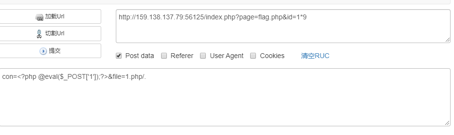
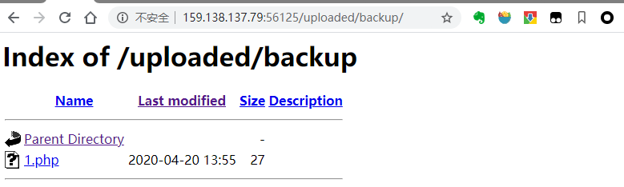

[toc]


### xctf_writeup_ics-07

#### 审计代码

> 浏览页面 发现了view-source链接 ，接下来审计代码

```php

    if (!isset($_GET[page])) {
      show_source(__FILE__);
      die();
    }

    if (isset($_GET[page]) && $_GET[page] != 'index.php') {
      include('flag.php');
    }else {
      header('Location: ?page=flag.php');  //无论page是什么最后都是会定向到flag.php的 这里没有用
    }

    ?>
```

***关键代码***

> `if (isset($_GET[id]) && floatval($_GET[id]) !== '1' && substr($_GET[id], -1) === '9')`
>
> ***floatval***函数：获取出参数的浮点数形式
>
> ```php
> <?php
> $var = '122.34343The';
> $float_value_of_var = floatval ($var);
> print $float_value_of_var; // 打印出 122.34343
> ?>
> ```
>
> ***substr函数***
>
> `substr ( string `$string` , int `$start` [, int `$length` ] ) : string`
>
> ```php
> $rest = substr("abcdef", -1);    // 返回 "f"
> ```
>
> ***php弱类型***
>
> > `===比较两个变量的值和类型；==比较两个变量的值，不比较数据类型`
>
> 
>
> 


```php
 <?php
      if (isset($_GET[id]) && floatval($_GET[id]) !== '1' && substr($_GET[id], -1) === '9') {
        include 'config.php';
        $id = mysql_real_escape_string($_GET[id]);
        $sql="select * from cetc007.user where id='$id'";
        $result = mysql_query($sql);
        $result = mysql_fetch_object($result);
      } else {
        $result = False;
        die();
      }

      if(!$result)die("<br >something wae wrong ! <br>");
      if($result){
        echo "id: ".$result->id."</br>";
        echo "name:".$result->user."</br>";
        $_SESSION['admin'] = True;
      }
     ?>
```

***所以可以构建payload如下：***：

`id=1' -- +9`

***其实只要1和9之间是任何字符都可***

>`mysql_real_escape_string ( string `$unescaped_string` [, resource `$link_identifier`= NULL ] ) : string`
>
>本函数将 `unescaped_string` 中的特殊字符转义，并计及连接的当前字符集

上面构造了id已经获取了admin权限

#### 审计写入文件代码

```php
<?php
     if ($_SESSION['admin']) {
       $con = $_POST['con'];
       $file = $_POST['file'];
       $filename = "backup/".$file;

       if(preg_match('/.+\.ph(p[3457]?|t|tml)$/i', $filename)){
          die("Bad file extension");
       }else{
            chdir('uploaded');
           $f = fopen($filename, 'w');
           fwrite($f, $con);
           fclose($f);
       }
     }
     ?>
```

> 此处关键的是如何绕过正则表达式
>
> `if(preg_match('/.+\.ph(p[3457]?|t|tml)$/i', $filename)`
>
> 以上匹配的是：***php php3 php4 php5 php7 phpt phptml***
>
> 绕过方法有：`filename.php/. `和`../filename.php/.`
>
> 原因是：***文件名中不允许带有/ 因为/表示目录的分割符 在php中，如果保存的文件中含有/ 会自动省略/后面的内容，/后面的.是为了达到匹配最后一个.的效果，***
>
> 前者直接在`/uploaded/backup/`文件下 ，后者则是直接绕过了`chdir`函数
>
> 文件在`/uploaded/`下
>
> 

#### 构造最后的payload



在`http://159.138.137.79:56125/uploaded/backup/`下可以看到构造的文件



#### 菜刀连接的到webshell

