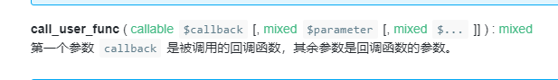

## 代码注入

> 必须条件 命令执行函数&可控制参数
>
> #### php中的代码执行函数
>
> > `eaval()`
> >
> > ==传入的参数php 且分号结尾==
> >
> > `assert()`
> >
> > ==函数是直接将传入的参数当成PHP代码直接，不需要以分号结尾==
> >
> > `preg_replace()`
> >
> > > `preg_replace('正则规则','替换字符'，'目标字符')`
> > >
> > > ==不需要加分号==
> > >
> > > 将目标字符中符合正则规则的字符替换为替换字符，此时如果正则规则中使用/e修饰符，则存在代码执行漏洞
> > >
> > > `preg_replace("/test/e",$_POST["cmd"],"jutst test");`
> > >
> > > ```php
> > > #phpinfo();
> > > eval(chr(112).chr(104).chr(112).chr(105).chr(110).chr(102).chr(111).chr(40).chr(41).chr(59))
> > > ```
> > >
> > > 
> >
> > `create_function`
> >
> > >
> > >
> > >创建匿名函数执行代码 必须加分号结尾
> > >
> > >`func =create_function('',$_POST['cmd']);$func();`
> >
> > `call_user_function`
> >
> > > 
> > >
> > > e,g:`callable : assert`
> > >
> > > ​     param:`phpinfo`
> >
> > ==动态函数==
> >
> > > ```php
> > > $a=$_GET('a')
> > > $b=$_GET('b')
> > > $a($b)
> > > ```
> > >
> > > 

#### tips

> 获取文件绝对路径：
>
> > __file__
>
> 读取文件：
>
> > `file_get_connects`
>
> 写文件
>
> > `file_put_connects`
> >
> > 
> >
> > 第二个参数(内容)写入第一个参数(filename)中

### 防御：

> 1. 尽量不要用`eval assert`
>
>    > php.ini中设置`disable_function`
>
> 2. `preg_replace`不要使用`e`模式

## 命令注入

​                                                                                                                                                                                    

### php中执行系统命令函数

>`system`
>
>> 执行系统命令 自带输出功能
>
>`exec`
>
>> 同system,需要自行输出结果 执行长度有限
>
>`shell_exec`
>
>> shell_exec — 通过 shell 环境执行命令，并且将完整的输出以字符串的方式返回
>
>`passthru`
>
>> 自带输出
>
>`popen()`
>
>> 返回文件指针 不直接显示文件结果
>
>==反引号==
>
>> ```php
>> `whoami`
>> ```
>>
>> 

### 防御

> 1. 禁用危险函数
>
> 2. 对特殊字符进行转义
>
>    > `addslash`函数等
>    >
>    > 
>
> 3. 