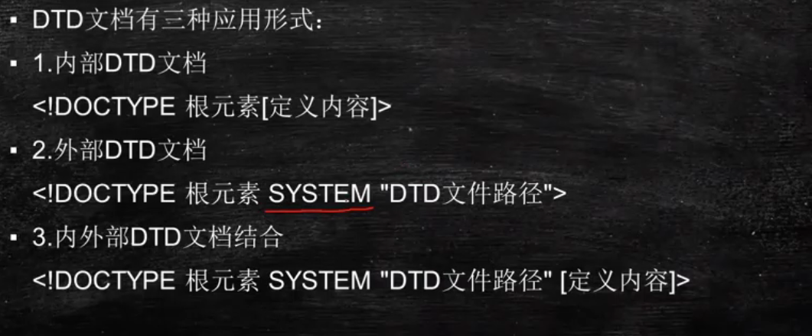
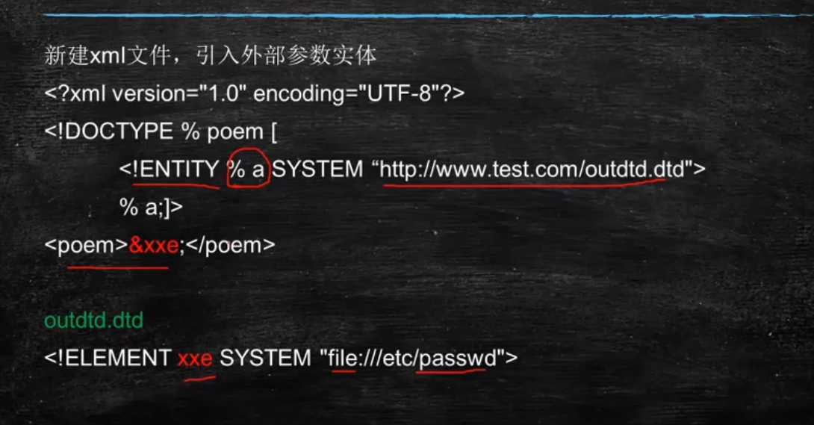
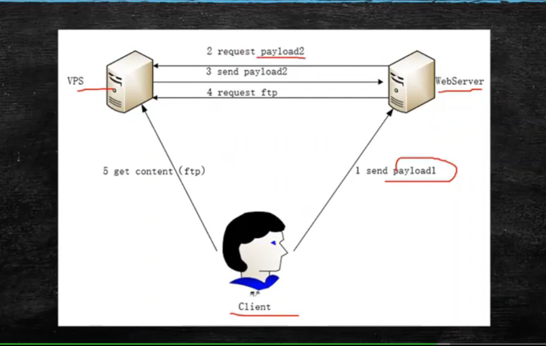
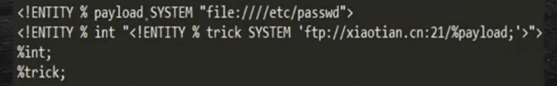

## 其他漏洞

### 文件下载漏洞

> `download.php?file=xxxx`
>
> 

### XXE(xml外部实体注入)

> `xml external entity injection`
>
> ==xml格式==
>
> 
>
> #### DTD(文档类型定义）
>
> > 定义xml的解析形式 验证xml 类似数据库表的结构的定义和表的数据关系
>
> > 
>
> #### xml实体
>
> 
>
> 普通实体
>
> 
>
> 外部实体
>
> 
>
> ### xml
>
> > 1. 数据存储
> > 2. 数据传输 方便读取
> > 3. 数据共享 不同语言间的数据共享

### 危害

> 1. 任意文件读取
>
>    > 通过file协议读取文件内容
>    >
>    > 
>
> 2. 端口扫描 获取内网服务等
>
>    > 

#### 漏洞发现

> 1. service为==xfire==de 
> 2. 明显的xml作为内容的输入点的
> 3. 某些json格式的request

> 1. xee直接回显
> 2. xee间接回显
>
> 
>
> 
>
> 
>
> 

> 

### 文件泄露

> `www.rar`
>
> `config.php.bak`
>
> `database.sql`
>
> ==php函数不当==
>
> `file_get_connects` 文件当做字符输出
>
> 

## 逻辑漏洞

### 水平和垂直越权

#### 密码找回回显测试

> 观察response中的字符和自己受到的密码中是否有相同的东西

### 枚举漏洞 验证码爆破

> 抓包 intruder模块爆破
>
> 

### url重定向跳转测试

> 后端直接接受前端的url 没有判断就跳转
>
> 防御: 后端验证

### 支付逻辑漏洞

> 支付过程中修改订单
>
> 数目修改为负值
>
> 防御:
>
> > 加密数据
> >
> > 加入token
> >
> > 后端验证

### 验证码有关

> ==验证码爆破:==
>
> tip: 提示只是密码错误 没有出现验证码错误
>
> 原因:没有及时清理session
>
> ==验证码回显==
>
> > 防御:服务端校验 不在客户端回显
>
> ==验证码绕过==
>
> > 对返回包中的布尔值等进行修改
> >
> > 防御:服务端验证
>
> ==验证码自动识别==
>
> > 提高验证难度 加噪声 验证次数等
>
> 