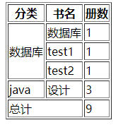
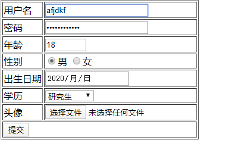
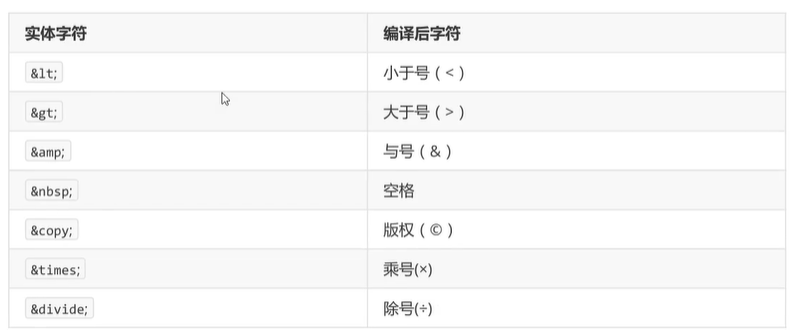
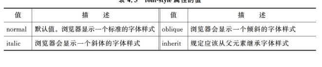
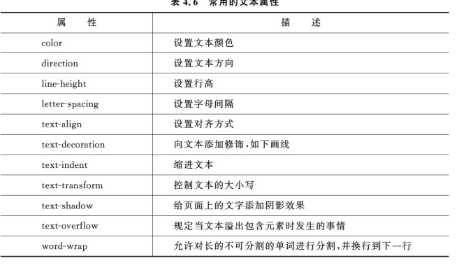
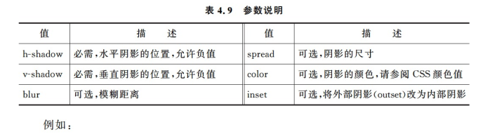
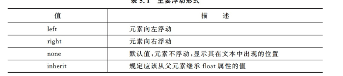
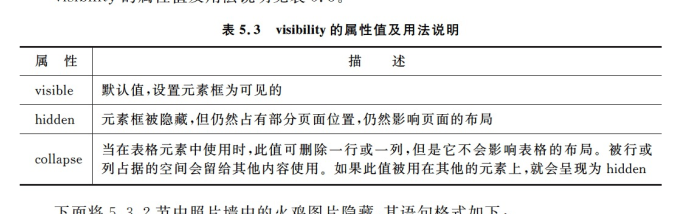

[toc]

# HTML

---


## 常用标签


### 段落


> `<p>这是段落<br></p>`
>
> 

### 标题

> `<h1>大标题</h1>`

### 容器


> ` <div>容器</div>`

### 区间

> `<sapn>  </span>`

### 列表

> ```html
> <ul>
>      <li>无序列表</li>
>      <ol>
>          <li>有序列表</li>
>          <li>列表项1</li>
> 
>      </ol>
>      <li>无序列表结束</li>
>  </ul>
> ```
>
> 

### 自定义列表

> ```html
> <dl>
>    <dt>luoyu</dt>
>    <dd>a boy</dd>
>    <dt>jj</dt>
>    <dd>fdfdkfjdk</dd>
> </dl>
> ```
>
> > dt:项目
> >
> > dd：项目的描述

### 图片

> ``
>
> alt:图片无法显示时候显示的文字信息

### 超链接

> `<a href="http://" target="_blank" rel="noopener noreferrer"></a>`
>
> 
>
> ```html
> <a href="# test" target="_blank">文字描述</a>
> <p id="test">测试成功</p>
> ```
>
> 

### 表格

```html
<table border="1">
    <tr>
        <th>name</th>
        <th>email</th>

    </tr>
    <tr>
        <td>小明</td>
        <td>fjdkfjd@qq.com</td>

    </tr>
    <tr>
        <td colspan="2" align="center">共一人</td>
    </tr>
</table>

colspan：跨列
rowspan:跨行
----

<table border="1">
    <tr>
        <th>分类</th>
        <th>书名</th>
        <th>册数</th>

    </tr>
    <tr>
        <td rowspan="3">数据库</td>
        <td>数据库</td>
        <td>1</td>
    </tr>
    <tr>
        <td>test1</td>
        <td>1</td>
    </tr>
    <tr>
        <td>test2</td>
        <td>1</td>
    </tr>
    <tr>
        <td>java</td>
        <td>设计</td>
        <td>3</td>
    </tr>
    <tr>
        <td colspan="2">总计</td>
        <td>9</td>
    </tr>
</table>

```



----

## 常用表单元素

### 文本框

> `:<input type="text" name="name" />`

### 密码框

> `<input type="password" name="psw"> `

### 单选

✔

> ```html
> <input type="radio" name="sex" value="男">man
>  <input type="radio" name="sex" value="女">woman
> ```
>
> 

### 单选下拉列表

> ```html
> 学历：
>  <select name="degree" id="">
>      <option value="1">小学</option>
>      <option value="2">中学</option>
>      <option value="4">大学</option>
>      <option value="3">高中</option>
>  </select>
> ```
>
> 

### 多选

> ```html
> 爱好：
>  <input type="checkbox" name="hobby" value="1">book
>  <input type="checkbox" name="hobby" value="2">movie
>  <input type="checkbox" name="hobby" value="3">eat
> ```
>
> 

### 分组下拉列表

> ```html
> <select name="分组下拉列表" id="">
>  <optgroup label="咖啡">
>      <option value="1">白色</option>
>      <option value="2">黑色</option>
> 
>  </optgroup>
>  <optgroup label="tea">
>      <option value="3">gree</option>
>      <option value="4">black</option>
> 
>  </optgroup>
> </select>
> ```
>
> 

### 多选下拉列表

> ```html
> <select name="多选下拉列表" id="" size="4" multiple="multiple">
>  <option value="1">1</option>
>  <option value="2">2</option>
>  <option value="3">3</option>
>  <option value="4">4</option>
>  
> </select>
> ```
>
> 

### 文本域

> `<textarea name="文本域" id="" cols="30" rows="10"></textarea>`

### 按钮

> ```html
> <form action="login" method="GET">
>  <input type="submit" value="提交">
>  <input type="reset" value="重置">
>  <input type="button" value="返回">
> </form>
> ```
>
> 

### 隐藏字段

> 页面间传递数据 而数据不需要显示
>
> ```html
> <form action="">
>  <input type="hidden" name="userid" value="1111">
> </form>
> ```
>
> 

### 表单属性

> `placeholder`:提示输入内容
>
> ` <input type="text" autofocus="true">`：自动聚焦
>
> 

```html
 <form action="" method="POST">
        <table border="1">
            <tr>
                <td><label for="usr">用户名</label></td>
                <td><input type="text" id="usr" name="username" required></td>
            </tr>
            <tr>
                <td>
                    <label for="psw">密码</label>
                </td>
                <td>
                    <inp<td><input type="password">
                </td>ut type="text" id="psw" type="password" required></td>

            </tr>
            <tr>
                <td><label for="ege">年龄</label></td>
                <td><input type="number" min="0" max="130"></td>
            </tr>
            <tr>
                <td><label for="sex">性别</label></td>
                <td>
                    <input type="radio" value="1" name="sex" id="sex">男
                    <input type="radio" value="2" name="sex" id="sex">女
                </td>
            </tr>
            <tr>
                <td>
                    <label for="data">出生日期</label>
                </td>
                <td>
                    <input type="date" id="data" name="data">
                </td>
            </tr>
            <tr>
                <td><label for="学历">学历</label></td>
                <td>
                    <select name="degree" id="学历">
                        <option value="0" selected>--请选择--</option>
                        <option value="1">高中</option>
                        <option value="1">初中</option>
                        <option value="3">研究生</option>
                        <option value="2">大学</option>
                    </select>
                </td>
            </tr>
            <tr>
                <td><label for="pic">头像</label></td>
                <td>
                    <input type="file" name="pic" id="pic">
                </td>
            </tr>
            <tr>
                <td colspan="2"><input type="submit" value="提交" class="button"></td>
            </tr>


        </table>


    </form>
</body>
```



---


## 文本格式化标签

### b&strong

> ```html
> <b>加粗</b><br>
> <strong>加粗且强调</strong>
> ```
>
> > 行级标签 不会自动换行

### i&em

> ```html
> <i>文字倾斜</i>
> <em>文字倾斜且强调</em>
> ```
>
> > 行级标签 不会自动换行

### pre 预格式化文本

> 保留换行 空格 和宽度
>
> ==字号会小一号浏览器支持的最小字号是12px==
>
> 块级别标签 在浏览器中独占一行


### small&big

> 文字缩小或者放大
>
> > ```html
> >  <small>samll</small>
> >     <big>大</big>
> > ```
> >
> > 行级标签

### sub&sup

> 设置上标 下标
>
> `<p>x<sup>2</sup>+x <sup>2</sup></sup></p>`
>
> 


## 实体转义

> 




## tips

### 块级标签行级标签装换

> `<p style="display: inline;">`宽高失效
> `<i style="display: block;">jfdkfkdfjk</i>`

### 通用属性

>1. id

>> 取唯一的名称


> 2. class :取类名
> 3. style：行内样式
> 4. title：鼠标移到时候显示名称


# CSS

### css选择符

> 1. HTML选择符

> `h1{text-align:center;color:bule}`对所有的h1标签采用样式

> 2. class选择符
>
> ***前面要加`.`***
>
> 

> ```html
> <style>
>      .a{font-size:20px}
>      .b{font-size:30px}
>      .c{font-size:40px}
> 
> </style>
> <p class="a">test1</p>
> <p class="b">test2</p>
> <p class="c">test3</p>
> ```
>
> 

> 3. id选择符
>
> 记得加`#`

> ```html
> <style>
>      #a{font-size:20px}
>      #b{font-size:30px}
>      #c{font-size:40px}
> </style>
> <p id="a">test1</p>
> <p id="b">test2</p>
> <p id="c">test3</p>
> ```

> 4.包含选择符
>
> `div a{ clolor:green;}`只有对包含了div中a起作用

> 5. 组合选择符
>
> `h1,h2,h3{}`

> 6. 伪元素
>
>    > P:hover{}:鼠标停留时候的样式
>    >
>    > P：first-letter 首字母
>    >
>    > p：first-line 第一行

## 文本字体属性

### 指定字体

> `p{*font-family*: 'Times New Roman', Times, serif;}`

### 字体大小

> ` *font-size*: medium;`
>
> > em设置文字大小：当父元素大小为16px时，例如div下的p，则p的大小为0.76xdiv大小
> >
> > `%`:父元素的百分比

### 字体风格

>`  *font-style*: normal;`
>
>
>
>

### 字体加粗

> `*font-weight*: normal;`

### 其他类型的字体属性

>
>
>

---


### 缩进文本

> 首行缩进两个字符
>
> `*text-indent*: 2em;`

### 对其方式

> ` *text-align*: center;`

### 字母间隔

> ` *letter-spacing*: normal;`

### 常用文本属性

> 

## 背景&边框

### 边框

> `*border-style*: double;` 边框的样式
>
> 
>
> ==设置4边的边框==
>
> > `border-left-style`.`border-top-style`.`border-bottom-style`

### 边框颜色

>
>
>`*border-color*: red green blue pink;`上 右 下 左
>
>3个颜色的时候：上 左右 下
>
>两个颜色：上下 左右
>
>一个：全部

### 边框大小：

> 
>
> `*border-width*: 1px;`

### 简写边框样式：

>
>
>border:5px solid red;

### 边框阴影

> `*box-shadow*: 10px 10px 5px #888888;`
>
> 
>
> 

### 圆角边框

> ` *border-radius*: 10px;`边框半径是10px

## 背景

### 背景颜色

> `*background-color*: pink;`
>
> 

### 图像背景

> ` *background-image*: url(*xxx*)`

### 背景位置

> `background- position:center;`
>
> 

### 背景大小

>
>
>`*background-size*: auto;`

### 背景相关属性


## CSS盒子模型


### 外边距

>
>
>`*margin*: 1px 2px 3px 4px;`上 右 下 左
>
>`*margin*: 1px 2px;` 上下 左右
>
>`*margin*: 1px auto;`水平居中

### 边框属性

> ```html
> border-width: 10px 10px 10px 10px;
> border-style: solid;
> border-color: pink;
> ```
>
> 

### 内边距（padding）

>同外边距
>
>

### 塌陷现象


```html
<style>
        .box4{
            background-color: yellow;
            border-width: 350px;
            padding:10px;
            
        }
        .box1,.box2,.box3{
            border-style: dashed;
            border-color:black;
            box-sizing: 1px;
            background-color: #00CCFF;
            margin: 10px;
            padding: 10px;
        }
        .box5{
            background-color: pink;
            margin: 10px;
        }
    </style>
</head>
<body>
    <div class="box4">
        <div class="box1">Box-1</div>
        <div class="box2">Box-2</div>
        <div class="box3">Box-3</div>
        <div class="box5"><p>jfjdkfjdskfjdfjskd</p></div>
      

    </div>
```

## 浮动定位

### float属性



> 向哪边浮动则向哪边对齐 之后的元素受到影响也随之上浮 

### clear属性


## 位置定位

### position

>
>
>

### 绝对定位

> `*position*: absolute;`
>
> `*top*: 50px;`通过设置可以使得元素出现在任何位置

### 相对定位

> `position: relative;`
>
> > 绝对定位：定位点为上级的元素原点
> >
> > 相对定位：定位点为原本自己的原点 与上级元素无关

### 固定定位

>
>
>`position: fixed;`
>
>> 以浏览器的窗口为定位 不会随着滚动条的拖动而改变
>>
>> 定位点为浏览器的窗口

## 隐藏&显示

### visibility



### 堆叠属性 z-index

> 大的在小的前面
>
> `z-index:-1`

## css动画

# js

### js输出

> ```javascript
> document.write("hello world")//页面直接输出
> console.log("你好") //控制台输出
> ```
>
> 

输出数据类型：
`typeof 100`

### 自动数据类型装换

> +:有一个数据类型为字符串 则+为字符串拼接
>
> 加法以外的则字符串会自动转为数字，
>
> 没有字符串的操作则数据类型先转为数字
>
> 

### 强制数据类型转化

> ```js
> Boolean(1)//非0即true 非空即真
> Number("a")//只有里面全是数字才转为数字  
> parseFloat//取浮点数
> parseInt//取整数
> ```
>
> 

### 关系运算符

> 两个操作是字符串则用字符编码值比较
>
> ```===`数值和数据类型都相等

### 三目运算符

> 表达式1？true语句 ：false语句

### 函数作用域

> 外部定义 内部使用 则变量的值一直保存 随着函数的改变而改变 ***全局变量***
>
> 内部定义则函数使用完成则销毁 ***局部变量***

### 数组

> ```js
> var arr=new Array(1,23,1)
> // var ar=new Array(10) 声明长度是10数组
> var arr=[1,2,3,4]
> document.write(arr[0])
> ***数组遍历***
>    
>     for(var i in arr){
>     document.write(arr[i]+"<br>")
> }
> // 栈
> arr.push("ly")
> arr.pop()
> // 队列
> arr.push("罗宇")
> arr.shift()
> //合并数组生成新的数v
> var arr=[1,2,3]
> document.write(arr)
> var arr1=[4,5,"ly"]
> var arr2 =arr.concat(arr1,"xxxx")
> document.write(arr2,"<br>")
> //分片生成新的数组
> var arr3 =arr2.slice(1,4)
> alert(arr3)
> // 拼接字符串
> document.write(arr.join("|"))
> // reverse
> document.write(arr.reverse())
> //sort
> document.write(arr.sort(function(a,b){
>     return b-a
> }))
> ```

### 字符串

> 

## BOM

### window

> window下的方法可以省略window
>
> confirm方法


### confirm方法

> 确定是返回的是true 如果取消返回false
>
> 

### prompt

> ```js
>     var tem=prompt("请输入内容：",123);
>     document.write(tem);
> ```
>
> 

### open

> `open('www.baidu.com','test','')`

### history

>当前窗口加载不同的url的记录
>
>```js
>    document.write(history.length);
>    history.back
>    history.forward
>```
>
>


### location

> ```javascript
>  alert(location.protocol);//协议
>     document.write(location.hostname)
>     document.write(location.pathname)
>     document.write(location.search) //get提交参数
> 
>      location.assign("https://www.baidu.com")
> ```
>
> 

## DOM

### 元素节点获取

> ```js
>  var div1 = document.getElementById("div")
>         document.write(div1.innerHTML)
>         document.write(div1.style, div1.id, div1.title)
>         div1.style.backgroundColor = "pink"
> ```
>
> 

### 获取样式

> ```javascript
>     var div2=document.getElementById("div2")
>     alert(getComputedStyle(div2)['width'])
> ```
>
> 
>
> 外联样式的获取方法
>
> ***获取自定义属性***
>
> ```alert(div2.getAttribute("xxx"))```