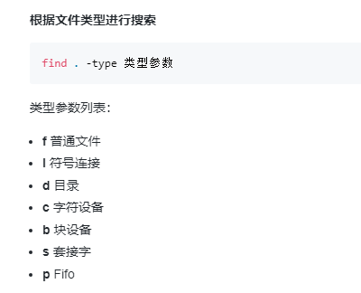

# 安恒红队百科全书读书笔记

[toc]

---

***上册***

---

## 信息收集篇

### windows

#### 用户/主机名&用户权限

> `whoami /user & whoami /priv`

#### 系统信息

> `systeminfo`
>
> 可查看域 补丁 等

#### 进程建立情况

> `netstat -ano`
>
> a 显示所有的连接和端口
>
> n 数字显示端口
>
> o 连接对应的进程ID

#### 机器名

> `hostname`
>
> 

#### 查杀软

> wmic 

#### 在线用户

> `quser`

#### 进程

> `tasklist`

#### 查看当前域

> `net config workstation`

#### 查看用户

> `net user`
>
> 查看某用户详细信息
>
> `net user xxx`

## linux

#### 用户

> `whoami`

#### 网络

> `ifconfig`

#### 端口

> `netstat -anpt`

#### 进程

> `ps -ef`

#### root历史命令

> `cat /root/.bash_history`

#### find命令

> `find . | xargs grep test` 查找当前目录下所有内容有test的文件
>
> `find . | grep mysql `查找带有mysql目录
>
> 