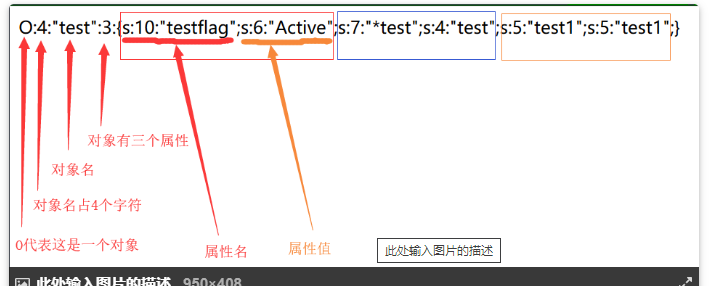

# 

> 为了存储或者传输，把对象以字符串的形式表现出来。
>
> 对象执行结束就会被销毁 ,序列化可以保存一个对象

## php

>#### 序列化
>
>`serialize`
>
>
>
>> 类种属性的不同序列化方式：
>>
>> `public`
>>
>> > 正常的序列化
>>
>> `Protected`
>>
>> > `%00类名%00属性名`
>
>#### 反序列化
>
>`unserialize`
>
>

### 反序列化漏洞

> ==必要条件==
>
> 参数可控 
>
> ==漏洞产生原因==
>
> > `_destruct`
> >
> > 反序列化执行成功后对象就立即销毁，调用了`-destruct`
> >
> > 相关的魔术方法：
> >
> > > (1)__construct()：当对象创建时会自动调用(但在unserialize()时是不会自动调用的)。
> > > (2)__wakeup() ：unserialize()时会自动调用
> > > (3)__destruct()：当对象被销毁时会自动调用。
> > > (4)__toString():当反序列化后的对象被输出在模板中的时候（转换成字符串的时候）自动调用
> > > (5)__get() :当从不可访问的属性读取数据
> > > (6)__call(): 在对象上下文中调用不可访问的方法时触发
> > >
> > > (7):sleep : 在序列化之前调用
> >
> > 

### ROP链

> 

### phar://